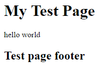
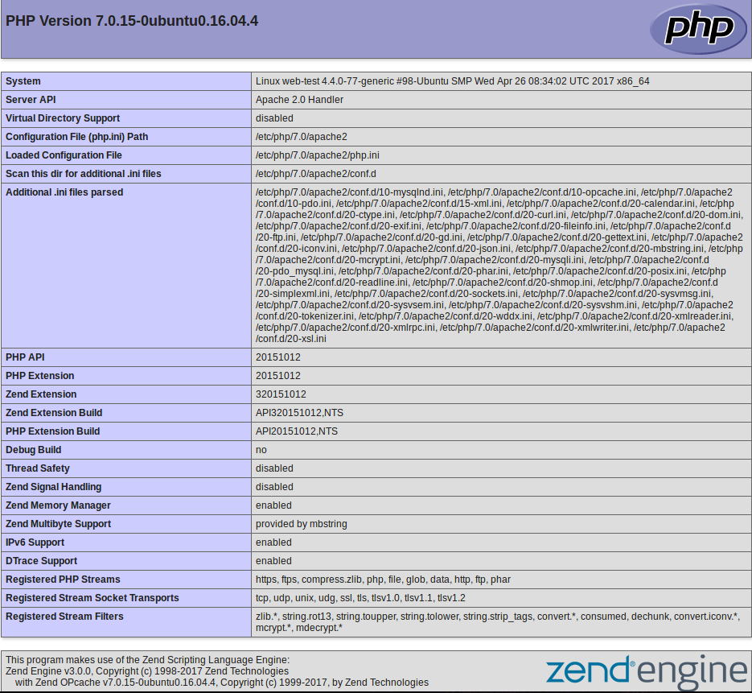

In this episode we will install a server-side scripting tool called **PHP** and configure it to run in conjunction with our **Apache Web Server**.

WordPress uses PHP to store and retrieve data to and from the MySQL database. To retrieve data, WordPress (via PHP) runs SQL queries to dynamically generate webpage content.

## Installing the PHP scripting language packages

Let's install all of the PHP packages that are required by default to run our WordPress website.

~~~
$ sudo apt install php libapache2-mod-php php-mcrypt php-mysql php-curl php-gd php-mbstring php-xml php-xmlrpc -y
~~~
{: .bash}

In my case, `apt` installed approximately 38 new packages and libraries in order to fulfil various required PHP dependencies.

These PHP related packages are required for the base or default installation of WordPress. WordPress also supports a variety of plugins which might have their own set of requirements. This might require you to install additional PHP packages whenever you decide to install and enable a new plugin. Most plugin documentation will list its own PHP requirements. You can install additional PHP packages using the same method that is documented here.

To test out our new installation of PHP lets make a test PHP file. As we saw previously if we place an `index.html` file under our root web directory, by default `/var/www/html/` when we go to the IP of our VM we will see the content of that file. If we instead create a file `index.php` in this directory it can be used in a similar way to generate an HTML website. The `.php` ending tells the webserver to interpret this file as a PHP file. Lets give it a try.
~~~
$ sudo nano /var/www/html/index.php
~~~
{: .bash}
~~~
  GNU nano 2.5.3                            File: /var/www/html/index.php

<h1>My Test Page</h1>
<?php
echo "hello world";
?>
<h2>Test page footer</h2>

                                                           [ Read 4 lines ]
^G Get Help     ^O Write Out    ^W Where Is     ^K Cut Text     ^J Justify      ^C Cur Pos      ^Y Prev Page    M-\ First Line
^X Exit         ^R Read File    ^\ Replace      ^U Uncut Text   ^T To Spell     ^_ Go To Line   ^V Next Page    M-/ Last Line
~~~
{: .output}
The first line is just plain HTML. The second line however is new. PHP is a programing language that can be inter mixed with HTML. The `<?php` tag indicates that everything to follow will be PHP code. The `?>` tag indicates that we are done writing PHP code. The `echo "hello world"` just prints out "hello world". When a browser visits the page it reads through the page and evaluates any PHP code in the file and places the result in line with any HTML it finds in the file. In our case the PHP code evaluates to "hello world". So the result is if we had an HTML file with the `<?php` ... `?>` replace by `hello world`. This might not seem very useful until you start thinking about the sorts of things you might be able to do with a programming language, such as dynamically presenting content based on different conditions or retrieving data from a database to present on the website.

Lets save this file and exit the editor and have a look at it through our browser by going to the IP of our virtual machine as we did for the HTML page. If we only specify the IP address we won't actually see our newly created PHP file what we see is the contents of the `index.html` file. The IP address we enter into our browser is mapped onto our websites root directory, by default that is `/var/www/html` so how does it decide what file to show us as we haven't specified one. We can view our `index.php` file instead of our `index.html` file by explicitly asking for it in the URL with `http://<IP-of-vm>/index.php`. If we do this we should see something like this.

## Modify Apache to look for PHP files First

By default, when a user requests a directory from Apache (without specifying a specific web page file), Apache first looks for a file called `index.html`. We want to change this behavior for WordPress so that Apache looks for `index.php` files first.  

To do this, we need to modify `/etc/apache2/mods-enabled/dir.conf` using a text editor with root privileges.  

~~~
$ sudo nano /etc/apache2/mods-enabled/dir.conf
~~~
{: .bash}

Originally, the output will look like this:

~~~
<IfModule mod_dir.c>
    DirectoryIndex index.html index.cgi index.pl index.php index.xhtml index.htm
</IfModule>
~~~
{: .output}

All we need to do is to move `index.php` to the beginning of the list. So, the edited output should now look like this:

~~~
<IfModule mod_dir.c>
    DirectoryIndex index.php index.html index.cgi index.pl index.xhtml index.htm
</IfModule>
~~~
{: .output}

After this modification has been completed, restart the Apache web service in order for this change to take immediate effect.

~~~
$ sudo systemctl restart apache2
~~~
{: .bash}

Then check the status of the Apache service by running the following:

~~~
$ sudo systemctl status apache2
~~~
{: .bash}

Look for the line that reads:

~~~
   Active: active (running) since...
~~~
{: .output}

## Verifying our PHP installation

The easiest way to test if PHP is working is to create and execute a simply PHP script. We will first create the script and place it in the 'web root'. In our case, the 'web root' is located at `/var/www/html`.  

We will call the script `info.php` and the purpose of it will be to display a report of our PHP environment when we view it with our web browser application. If our browser displays the report, then we know that PHP is working. If it does not, then we know that we've made a mistake.

Create the script as follows:

~~~
$ sudo nano /var/www/html/info.php
~~~
{: .bash}

Add the following text (which is actually valid PHP code):

~~~
<?php
phpinfo();
?>
~~~
{: .output}

Then save and exit the file.  

To execute the script, we need to launch our web browser and navigate to the following URL:  

`http://your_server_IP_address/info.php`  

You should see something like the image below.

It is a very good idea to remove this file, once you are satisfied that this test is successful. The reason is that it could give a potential attacker too much information about your environment. To remove the file, execute the following command:

~~~
sudo rm /var/www/html/info.php
~~~
{: .bash}
