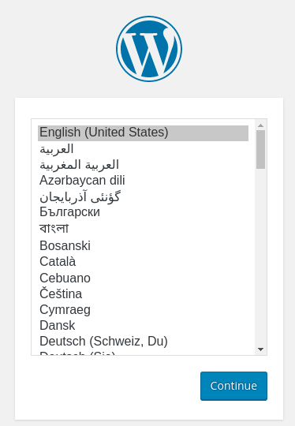
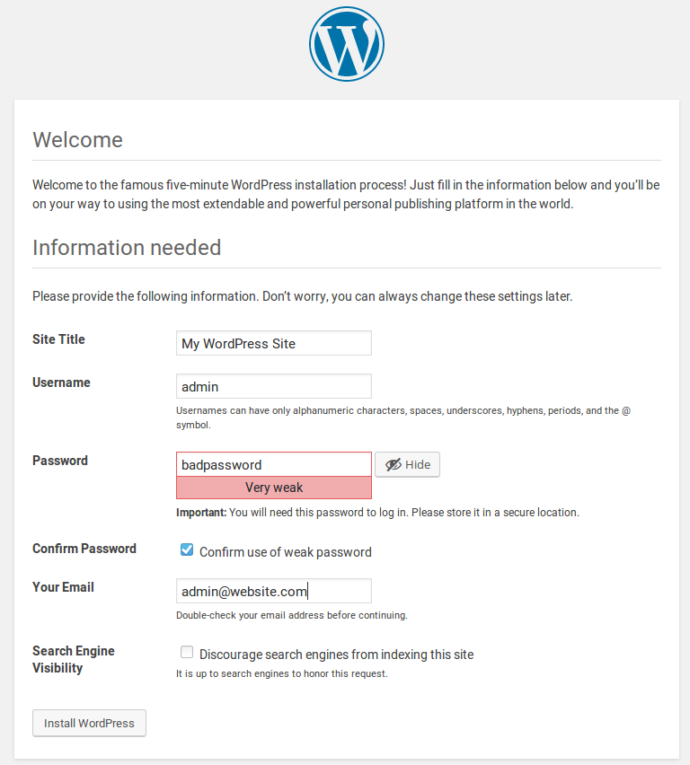
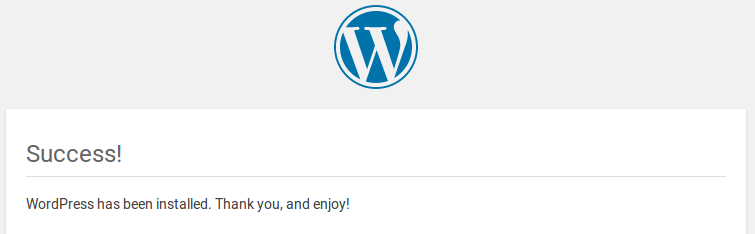

During the previous three episodes, we finished installing our LAMP software stack on our virtual machine. Consequently, in this episode we are now ready to move on to the activity of installing and configuring our WordPress application. The entire procedure will require us to accomplish the following systems administration tasks:  

- we will create a WordPress database and user  
- we will modify our Apache web server configuration
- we will download the WordPress software
- we will configure the WordPress web root directory  
- we will complete the installation using the WordPress web interface

## Create the WordPress MySQL Database and User

The very first thing we need to do is log into our database command prompt using the MySQL root administrative account. To do so, issue the following command:  

~~~
$ mysql -u root -p
~~~
{: .bash}

You will be prompted to enter your password. (Remember from a previous episode, that we had set this password to `rootMySQLPassword`.) We now want to create a separate database that only the WordPress application can access. To keep things simple, let's name the database `wordpress`.

~~~
mysql> CREATE DATABASE wordpress DEFAULT CHARACTER SET utf8 COLLATE utf8_unicode_ci;
~~~
{: .bash}

If successful, the output should look like the following:  

~~~
Query OK, 1 row affected (0.00 sec)
~~~
{: .output}

Next, it is a good idea to also create a separate MySQL user (who does *NOT* have *total* and *unlimited* MySQL administrative access) that WordPress will use exclusively to administrate the `wordpress` database. In order to tighten security, only WordPress is required to have access to this user's authentication credentials and the only database this user has access to is the `wordpress` database. Again, to keep things simple, let's call this user `wordpressuser`. In production, you would want to create a strong and unique password for this user. However, for this course, we will use `userMySQLPassword` as the password.

~~~
mysql> GRANT ALL ON wordpress.* TO 'wordpressuser'@'localhost' IDENTIFIED BY 'userMySQLPassword';
~~~
{: .bash}

If successful, the output should look like this:

~~~
Query OK, 0 rows affected, 1 warning (0.00 sec)
~~~
{: .output}

Finally, in order to ensure that our modifications take immediate effect, we need to flush the privileges.

~~~
mysql> FLUSH PRIVILEGES;
~~~
{: .bash}

The output should look like this:

~~~
Query OK, 0 rows affected (0.00 sec)
~~~
{: .output}

You may now exit the MySQL database system management application.

~~~
mysql> QUIT;
~~~
{: .bash}

## Modify the Apache Web Server Configuration

For WordPress to function properly, we need to make a few minor modifications to our Apache web server configuration.  

First, we need to enable the use of `.htaccess` files. The reason for this is that WordPress and, more specifically, many of the WordPress plugins use this file to perform "in-directory" adjustments which will affect the behavior of Apache.

To do this, we need to modify the main Apache configuration file, located here: `/etc/apache2/apache2.conf`.

~~~
$ sudo nano /etc/apache2/apache2.conf
~~~
{: .bash}

Look for the section that starts with this heading:  

~~~
# Sets the default security model of the Apache2 HTTPD server. It does
# not allow access to the root filesystem outside of /usr/share and /var/www.
# The former is used by web applications packaged in Debian,
# the latter may be used for local directories served by the web server. If
# your system is serving content from a sub-directory in /srv you must allow
# access here, or in any related virtual host.
~~~
{: .output}

In order to allow `.htaccess` files, we need to set an `AllowOverride` directive within a `Directory` block that points to our web root directory. For this reason, append this block to the bottom of this section:  

~~~
<Directory /var/www/html/>
    AllowOverride All
</Directory>
~~~
{: .bash}

Then save and exit the file.

Second, in order to use WordPress's permalink feature, we need to enable the `mod_rewrite` Apache module. To accomplish this, we can invoke the `a2enmod` command as follows:

~~~
$ sudo a2enmod rewrite
~~~
{: .bash}

~~~
Enabling module rewrite.
To activate the new configuration, you need to run:
  service apache2 restart
~~~
{: .output}

Before restarting the Apache service, we should test to make certain that our configuration changes are correct.

~~~
$ sudo apache2ctl configtest
~~~
{: .bash}

Look for the following result:

~~~
Syntax OK
~~~
{: .output}

If everything is OK, then it is safe to restart Apache so that our changes take immediate effect.

~~~
$ sudo systemctl restart apache2
~~~
{: .bash}

And, to be certain, please check the status of the Apache service by running the following:

~~~
$ sudo systemctl status apache2
~~~
{: .bash}

Look for the line that reads:

~~~
   Active: active (running) since...
~~~
{: .output}

## Download the WordPress Software

At this point, all of the prerequisite software for our virtual machine has been properly installed and configured. We are now ready to download the latest version of WordPress which is housed at `wordpress.org`. We'll use the `wget` command to grab the installation package and store it in the `/tmp` directory until it's ready to moved to `/var/www/html`.

~~~
$ wget http://wordpress.org/latest.tar.gz -O /tmp/latest.tar.gz
$ cd /tmp
~~~
{: .bash}

~~~
  % Total    % Received % Xferd  Average Speed   Time    Time     Time  Current
                                 Dload  Upload   Total   Spent    Left  Speed
100 7851k  100 7851k    0     0  4176k      0  0:00:01  0:00:01 --:--:-- 4176k
~~~
{: .output}

Like a lot of open source software available via the Internet, the file name (`latest.tar.gz`) ends with a `.tar.gz` extension. This means that this is a **TAR** (short for Tape Archiving) package that has been compressed using the **GNU zip** utility. To decompress and extract the file contents, we will use the following command:  

~~~
$ tar xzvf latest.tar.gz
~~~
{: .bash}

The required command-line arguments listed above are as follows:

- `x`: extract the package contents  
- `z`: decompress the file using **GNU zip**
- `v`: be verbose - show me all of the file paths
- `f`: extract from a specified file (`latest.tar.gz`)

If you engage is any subsequent Linux systems administration during the remainder of your lifetime, you will probably use the `tar` all the time.

The output should look something like this:

~~~
wordpress/
wordpress/wp-settings.php
wordpress/wp-cron.php
wordpress/wp-comments-post.php
...
... lots and lots more files...
...
wordpress/wp-includes/update.php
wordpress/wp-includes/comment.php
wordpress/wp-includes/class-wp-text-diff-renderer-table.php
wordpress/wp-config-sample.php
~~~
{: .output}

The next step is to create a blank `.htaccess` file that WordPress will use later. Then use the `chmod` command to set appropriate file permissions.

~~~
$ touch /tmp/wordpress/.htaccess
$ chmod 660 /tmp/wordpress/.htaccess
~~~
{: .bash}

Basically, the `660` argument gives read/write access to both the file's specified owner and group.

At this point, it's also a good idea to create a working copy the sample WordPress configuration file. Later, we will modify this file to include all of the customizations which are specific for each of our own WordPress websites.

~~~
$ cp /tmp/wordpress/wp-config-sample.php /tmp/wordpress/wp-config.php
~~~
{: .bash}

While we're at it, we should also create an `upgrade` directory so that WordPress can use this to perform any subsequent software upgrades without running into any permission conflict errors.

~~~
$ mkdir /tmp/wordpress/wp-content/upgrade
~~~
{: .bash}

Now we can finally copy the entire contents to the web document root.

~~~
$ sudo cp -av /tmp/wordpress/. /var/www/html
~~~
{: .bash}

## Configure the WordPress Web Root Directory

Before we complete the installation via our web browser, we need to perform a couple of additional systems administration tasks. First, we need to set reasonable file and directory ownership and permission attributes. These values are not configured by default and, unless we do this, WordPress will not function properly. Second, we need to generate secret keys which will help provide greater security for our installation.

### Adjust Ownership and Permission Attributes

To begin with, we need to execute some basic commands that will set appropriate ownership and permission attributes for the directories and files that are stored in our WordPress web root directory. Once again, this directory is `/var/www/html`.

It's possible, going forward, that we might need to edit, copy, move, add, rename, or remove WordPress files and directories. For example, if we update WordPress or install a new WordPress plugin, these actions would fail unless we adjust the default file and directory settings.

The two objectives for this section are as follows:  

1) Make the Linux user account that we used to log into the VM, `ubuntu`, the owner of all files and directories contained in `/var/www/html`.  

2) Make certain that the Linux group account that runs the Apache service, `www-data`, can also perform the same file management functions.  

To accomplish both of these tasks at once, we can issue the following command:

~~~
$ sudo chown -R ubuntu:www-data /var/www/html
~~~
{: .bash}

The `-R` option basically instructed the `chown` (or change-ownership) command to execute on every file and directory in the `/var/www/html` directory root recursively.

Next, we need to ensure that all **new** files created within every subdirectory of `/var/www/html` also inherit the `www-data` group. Again, this is to make certain that the account responsible for running the Apache service still retains group ownership of all WordPress content. This attribute is referred to as a `setgid` bit. Consequently, to enable the `setgid` bit on every WordPress subdirectory, we can issue the following command:

~~~
$ sudo find /var/www/html -type d -exec chmod g+s {} \;
~~~
{: .bash}

In this case, we basically used the `find` command to locate all subdirectories in the WordPress web root directory and then we executed the `chmod` command to enable their `setgid` attribute. Let's move on...  

The web server program will require to write files and make theme or plugin changes to the `wp-content` directory. To enable this, we'll issue the following three `chmod` commands:

~~~
$ sudo chmod g+w /var/www/html/wp-content
$ sudo chmod -R g+w /var/www/html/wp-content/themes
$ sudo chmod -R g+w /var/www/html/wp-content/plugins
~~~
{: .bash}

And that takes care of customizing all of the required file and directory ownership and permission settings.

### Configure the WordPress Configuration File

Now comes the part where we make specific changes to our main WordPress configuration file.

The first thing we need to do is provide better security and create new secret keys. We do NOT want to use the default keys that were provided because then it would be very easy for attackers to guess at their values. Lucky for us, the WordPress website provides a useful utility that can generate new random keys for us.

To generate new random keys, we will issue the following command:

~~~
$ curl -s https://api.wordpress.org/secret-key/1.1/salt/
~~~
{: .bash}

You should get back a result that looks similar to this:

~~~
define('AUTH_KEY',         '^u,3mX7Nq^FBHHpEU-t!]`+V-pi%+[miS5K@B?G1#N])O,L(p{L5IOi@-LlRYzj=');
define('SECURE_AUTH_KEY',  'c#|EYF@n(6L}h!f=0R!iKc@Fb3k(XbkbIh@<tLzHb(.gW;a1yh-<^{<U_+Db4edn');
define('LOGGED_IN_KEY',    '7n_ejfieDetb<|+dEbiR<doD;t%#<^ZmHQU]m<3N38K<f/3R6C.wYQ+M|c~:CMU}');
define('NONCE_KEY',        'LC^,-vm`9F)<b}SNw&h-/w#u~9R!G]*R3~HvMEx6+-KO|+e3gylhTDSg#Gh7-9sv');
define('AUTH_SALT',        '(le/k2eZDhR`;^Vh%ZuFBqW<hKgrJaWo!ks)q(G^pw-O)akt0!o~{#xyciC}x_CX');
define('SECURE_AUTH_SALT', ':@K^VRNux}t}{W r-|7(~Q!bY-)9W+S!I>R=M@R-@qXX<I{D(<lt[+-kSzvimo~3');
define('LOGGED_IN_SALT',   '+11P|@+WO-8+`nJ^n*Qe]Z2DUG$b|1RLYr_uW0;_G-S;lZ<[q,ra@ukw+,*,5ivi');
define('NONCE_SALT',       '3{8xtE LEaw%?j[i%%/2x]<r8|s>e(blp abLpraM;X41Z)+Yroe7mlO9%x`C!{i');
~~~
{: .output}

Please note: Do NOT just copy and paste these keys into your own configuration. Please generate your own unique values. The above output is simply an example.  

In any event, we need to paste our own unique secret keys into our WordPress configuration file. To that, please open the configuration file using your editor:

~~~
nano /var/www/html/wp-config.php
~~~
{: .bash}

Then find the section that contains the default secret keys. It should look like this:

~~~
/**#@+
 * Authentication Unique Keys and Salts.
 *
 * Change these to different unique phrases!
 * You can generate these using the {@link https://api.wordpress.org/secret-key/1.1/salt/ WordPress.org secret-key service}
 * You can change these at any point in time to invalidate all existing cookies. This will force all users to have to log in again.
 *
 * @since 2.6.0
 */
define('AUTH_KEY',         'put your unique phrase here');
define('SECURE_AUTH_KEY',  'put your unique phrase here');
define('LOGGED_IN_KEY',    'put your unique phrase here');
define('NONCE_KEY',        'put your unique phrase here');
define('AUTH_SALT',        'put your unique phrase here');
define('SECURE_AUTH_SALT', 'put your unique phrase here');
define('LOGGED_IN_SALT',   'put your unique phrase here');
define('NONCE_SALT',       'put your unique phrase here');
~~~
{: .output}

Delete this section and then paste the values that you generated for yourself. Once again, as an example, the lines I replaced now look like this:  

~~~
define('AUTH_KEY',         '^u,3mX7Nq^FBHHpEU-t!]`+V-pi%+[miS5K@B?G1#N])O,L(p{L5IOi@-LlRYzj=');
define('SECURE_AUTH_KEY',  'c#|EYF@n(6L}h!f=0R!iKc@Fb3k(XbkbIh@<tLzHb(.gW;a1yh-<^{<U_+Db4edn');
define('LOGGED_IN_KEY',    '7n_ejfieDetb<|+dEbiR<doD;t%#<^ZmHQU]m<3N38K<f/3R6C.wYQ+M|c~:CMU}');
define('NONCE_KEY',        'LC^,-vm`9F)<b}SNw&h-/w#u~9R!G]*R3~HvMEx6+-KO|+e3gylhTDSg#Gh7-9sv');
define('AUTH_SALT',        '(le/k2eZDhR`;^Vh%ZuFBqW<hKgrJaWo!ks)q(G^pw-O)akt0!o~{#xyciC}x_CX');
define('SECURE_AUTH_SALT', ':@K^VRNux}t}{W r-|7(~Q!bY-)9W+S!I>R=M@R-@qXX<I{D(<lt[+-kSzvimo~3');
define('LOGGED_IN_SALT',   '+11P|@+WO-8+`nJ^n*Qe]Z2DUG$b|1RLYr_uW0;_G-S;lZ<[q,ra@ukw+,*,5ivi');
define('NONCE_SALT',       '3{8xtE LEaw%?j[i%%/2x]<r8|s>e(blp abLpraM;X41Z)+Yroe7mlO9%x`C!{i');
~~~
{: .output}

Ok. We are almost done. The second last thing we need to do is modify the configuration file so that the WordPress website knows how to take to the WordPress database which we created much earlier during this episode. We need to tell the WordPress website that the database name is `wordpress`, the database user is `wordpressuser`, and the database user's password is `userMySQLPassword`. These variables are defined near the top of the configuration document. Modify them so that they look like this:

~~~
define('DB_NAME', 'wordpress');

define('DB_USER', 'wordpressuser');

define('DB_PASSWORD', 'userMySQLPassword');
~~~
{: .output}

The very last configuration change is to define the method that WordPress should use to write to the Ubuntu filesystem. We've already given the web server group explicit permission to write directly to WordPress web root subdirectories (like `wp-content/themes` and `wp-content/plugins`, for example) so we can specify the method to be `direct`. If we did not specify `direct`, then WordPress would assume that we wanted to use FTP and it would prompt us for our FTP credentials every time we performed any upload, update, or installation actions.

This setting can be appended to the end of the confirguration document as follows:

~~~
define('FS_METHOD', 'direct');
~~~
{: .output}

You may now save and exit the WordPress configuration file.

## Complete the Installation using the WordPress GUI

The good new is that we are now finished using the Linux command line! Now that all of the necessary system administration tasks have been completed, we are ready to complete the WordPress installation using our web browser interface.  

Open your web browser and navigate as follows:

~~~
https://<your_externalserver_IP>
~~~
{: .output}

For example, to get to my WordPress site, I navigated here:

~~~
https://206.167.181.126
~~~
{: .output}

If everything is in proper working order, you should see a message that is prompting you to select the language which you would like to use.

If you see this, congratulations! You accomplished a great deal of work to get here. In any event, I selected English. And then I clicked `Continue`.

This should take you to the "Welcome" page. On this screen, You will need to provide the following information:  

- Title of your WordPress site
- WordPress administrator username
- WordPress administrator user's password
- Your email address
- And whether or not you want search engines to index your website

After entering this information, click `Install WordPress`.

If all goes well, you should see the following "Success!" message which will prompt you to log in using your new WordPress administrator account. Click `Log In`.

Once you log in, you will be presented with the WordPress administration dashboard interface. From here, you can make all the customizations, install all the updates and plugins, and create all the content that you so desire.

