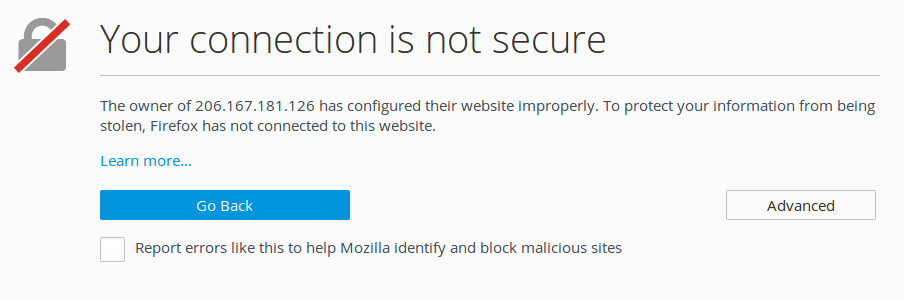
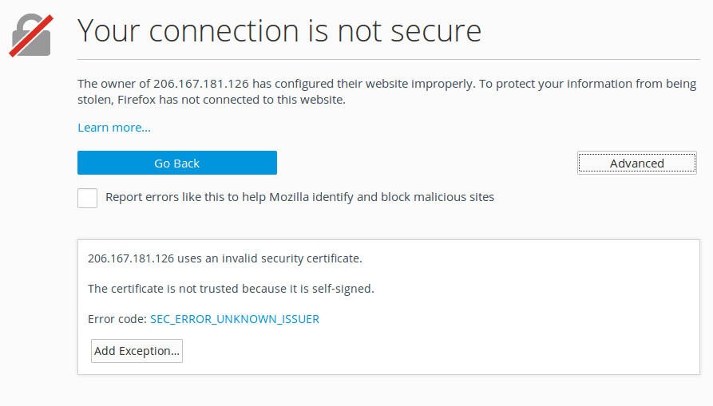
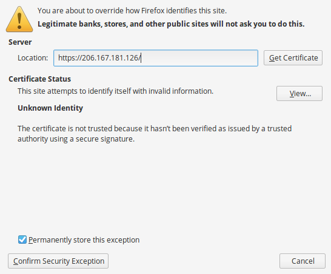

In this episode we'll create a self-signed SSL certificate to use with our Apache server in order to secure communication with our WordPress application. SSL stands for Secure Sockets Layer. It has recently been replaced by Transport Layer Security (TLS). However, during this course, we'll still refer to it as SSL, as this seems to be the acronym that is referenced most frequently in most documentation.

The purpose of using SSL certificates is as follows:
- the connection uses symmetric cryptography to encrypt all transmitted data  
- use of trusted cryptographic keys ensures that the identity of the web server can be authenticated
- since each message includes a message authentication code, the connection can ensure data integrity (ie. there has been no loss or alteration of data)

There are two methods of creating SSL certificates. You can create one that will be signed by a trusted certificate authority, such as GoDaddy, Symantec, Verizon, DigiCert, etc. Or you can create your own self-signed SSL certificate. Many of these authorities will charge for providing the service of signing your SSL certificates. However, there is a free service for providing 3rd party signed certificates, [letsencrypt.org](https://letsencrypt.org/), while it might not provide certificates suitable for exchanging say, banking information, it is good enough for many situations and it is free and easy.However, to create a certificate signed by a signing authority you would need a valid domain name pointing to your VM and obtaining such a domain name is beyond the scope of this course.

While both self-signed and 3rd party signed certificates will encrypt communication between our web browsers and the WordPress server, self-signed certificates cannot be used to validate the identity of our web servers. For this reason, in production environments, it is recommended that you obtain digital certificates from a trusted certification authority. Self-signed certificates are still very useful for working with applications in a development, test, or educational environment (like this course, for example). Self-signed SSL certificates will still encrypt network traffic when users or administrators log into WordPress using password authentication in order to create and maintain content, as well as modify configuration settings. Naturally, this is communication that we *REALLY* don't want to be transmitting across the wide-open Internet in plain text.

## Creating the SSL certificate
Before we can create our certificate, we need to make certain that the OpenSSL package is installed. It should already be there but, in case that it is missing, please perform the following:  

~~~
$ sudo apt update
$ sudo apt install openssl
~~~
{: .bash}

TLS/SSL works by using both a public certificate (which we share) and a private key (which is kept secret at all times and remains on the server). Basically, the certificate is shared with any user who requests content from our web site and it is used to decrypt each transmission which had already been encrypted by the private key.

The process is as follows:  
- we will issue a command to create the certificate/private key
- then we will be asked a series of questions which help to identify our web site

The command looks like this:  
~~~
$ sudo openssl req -x509 -nodes \
  -days 365 -newkey rsa:2048 \
  -keyout /etc/ssl/private/apache-selfsigned.key \
  -out /etc/ssl/certs/apache-selfsigned.crt
~~~
{: .bash}

Before considering any output, let's go over what that command really does. First, you are executing both `sudo` and `openssl` to invoke administrator access and create the SSL certificate and private key. However, the command itself requires a lot more information, such as:  

- `req`: We would like to use the X.509 certificate standard.
- `x509`: We want to make a self-signed certificate, so please don't bother generating certificate signing request.
- `-nodes`: Please skip the option to secure this certificate with a passphrase.
- `-days 365`: Please keep this certificate valid for 1 year.
- `-newkey rsa:2048`: Please create a secret key at the same time. Please make it an RSA key that is 2048 bits strong.
- `-keyout`: This is the file path in which to store our new secret private key.
- `-out`: This is the file path in which to store our new SSL certificate.  

Now to deal with the series of questions that help to identify our web site.  

You will first be prompted to identify your location information, such as Country, State or Province, and City.

~~~
Generating a 2048 bit RSA private key
................................................................+++
..........+++
writing new private key to '/etc/ssl/private/apache-selfsigned.key'
-----
You are about to be asked to enter information that will be incorporated
into your certificate request.
What you are about to enter is what is called a Distinguished Name or a DN.
There are quite a few fields but you can leave some blank
For some fields there will be a default value,
If you enter '.', the field will be left blank.
-----
Country Name (2 letter code) [AU]:CA
State or Province Name (full name) [Some-State]:British Columbia
Locality Name (eg, city) []:Vancouver
~~~
{: .bash}

Next, you will be asked to provide some information about your organization or place of employment.  

~~~
Organization Name (eg, company) [Internet Widgits Pty Ltd]:Province University
Organizational Unit Name (eg, section) []:Research Computing
~~~
{: .bash}

Finally, you will be asked to provide information about your server. NOTE: for `Common Name`, you can just provide the external IP address of your virtual machine.

~~~
Common Name (e.g. server FQDN or YOUR name) []:206.167.181.126
Email Address []:admin@fake.org
~~~
{: .bash}

And that's it. You can verify the creation of your private key as follows:

~~~
$ sudo ls -l /etc/ssl/private/
~~~
{: .bash}  

~~~
total 8
-rw-r--r-- 1 root root     1704 Apr 30 14:57 apache-selfsigned.key
-rw-r----- 1 root ssl-cert 1704 Apr 30 14:11 ssl-cert-snakeoil.key
~~~
{: .output}

You can also verify the creation of your public SSL certificate:  

~~~
$ ls -l /etc/ssl/certs/
~~~
{: .bash}  

~~~
...
other certificate files
...

-rw-r--r-- 1 root root   1411 Apr 30 14:57 apache-selfsigned.crt

...
other certificate files
...
~~~
{: .output}

## Creating a Diffie-Hellman group

At the same time, we should also create what's called a Diffie-Hellman group. What is that? Good question.

When two computers start communicating to send web content, passwords, or any other data they need to exchange some information (keys), first which lets each computer involved in the communication know how the data will be encrypted and also decrypted so that they can understand each other but other computers (and possibly humans) along the public communication network being used (in our case the Internet) can not understand the information transmitted back and forth so that this information stays private between the two computers. Diffie-Hellman groups determine the strength of the key that is used during this encryption key exchange process, so that the keys which are exchanged to encrypt the data, are themselves encrypted using these Diffie-Hellman groups.

When creating a Diffie-Hellman group you can choose a group number the larger the group number the stronger the encryption. However there is a trade off. Higher group numbers also require more time to compute the key. A good compromise is to choose one that matches the strength of the RSA private key that we created in the previous section, used to encrypt the data sent and received. Please note, this will take more than a few moments.

~~~
$ sudo openssl dhparam -out /etc/ssl/certs/dhparam.pem 2048
~~~
{: .bash}  

~~~
Generating DH parameters, 2048 bit long safe prime, generator 2
This is going to take a long time
................................................................
.......................+......................................+.
[and so on for more than a screen length...]
......................+..........................+..............
++*++*
~~~
{: .output}  

After the command has completed, your stong DH group file will be stored here:

`/etc/ssl/certs/dhparam.pem`

We will reference this file path in the very next section.

## Configure Apache to use your certificate

The next step is for us to modify our Apache configuration and tell it how to use the certificate, private key, and Diffie-Hellman group that we created in the previous section.

Our modifications will include the following:  

- create a configuration snippet to specify our default SSL settings  
- modify our SSL Apache Virtual Host file to reference our credentials  
- modify the unencrypted Virtual Host to automatically redirect HTTP requests to our encrypted Virtual Host using HTTPS  

### Apache configuration snippet with default SSL settings

In this section, we will set up Apache with a strong SSL cipher suite and enable various advanced features in order to make our web server more secure. Basically, we are just 'hardening' Apache SSL. To do so, we need to create a new file called `ssl-params.conf`.

~~~
$ sudo nano /etc/apache2/conf-available/ssl-params.conf
~~~
{: .bash}

To make this simple, we will just copy and paste the contents listed below which were created by Remy van Elst and published on the [Cipherli.st](https://cipherli.st/) web site.  

~~~
# from https://cipherli.st/
# and https://raymii.org/s/tutorials/Strong_SSL_Security_On_Apache2.html

SSLCipherSuite EECDH+AESGCM:EDH+AESGCM:AES256+EECDH:AES256+EDH
SSLProtocol All -SSLv2 -SSLv3
SSLHonorCipherOrder On
# Disable preloading HSTS for now.  You can use the commented out header line that includes
# the "preload" directive if you understand the implications.
#Header always set Strict-Transport-Security "max-age=63072000; includeSubdomains; preload"
Header always set Strict-Transport-Security "max-age=63072000; includeSubdomains"
Header always set X-Frame-Options DENY
Header always set X-Content-Type-Options nosniff
# Requires Apache >= 2.4
SSLCompression off
SSLSessionTickets Off
SSLUseStapling on
SSLStaplingCache "shmcb:logs/stapling-cache(150000)"

SSLOpenSSLConfCmd DHParameters "/etc/ssl/certs/dhparam.pem"
~~~
{: .bash}  

Then save and exit this document. NOTE: the `SLOpenSSLConfCmd DHParameters` attribute references your Diffie-Hellman group file path.  

### Default Apache SSL Virtual Host configuration file

The next thing we need to do is edit `/etc/apache2/sites-available/default-ssl.conf`.

Open the file in nano.  

~~~
$ sudo nano /etc/apache2/sites-available/default-ssl.conf
~~~
{: .bash}

Under the `ServerAdmin webmaster@localhost` line, add your web server's external IP address. Mine is `206.167.181.126`, so my entry looks like the one below:

~~~
ServerName 206.167.181.126
~~~
{: .bash}

Next, replace the `SSLCertificateFile` and `SSLCertificateKeyFile` entries with the following:

~~~
#SSLCertificateFile     /etc/ssl/certs/ssl-cert-snakeoil.pem
#SSLCertificateKeyFile /etc/ssl/private/ssl-cert-snakeoil.key
SSLCertificateFile      /etc/ssl/certs/apache-selfsigned.crt
SSLCertificateKeyFile /etc/ssl/private/apache-selfsigned.key
~~~
{: .bash}

Finally, uncomment the following section:

~~~
#   "force-response-1.0" for this.
# BrowserMatch "MSIE [2-6]" \
#               nokeepalive ssl-unclean-shutdown \
#               downgrade-1.0 force-response-1.0
~~~
{: .bash}  

So that it looks like this:

~~~
#   "force-response-1.0" for this.
BrowserMatch "MSIE [2-6]" \
               nokeepalive ssl-unclean-shutdown \
               downgrade-1.0 force-response-1.0
~~~
{: .bash}

Then save and exit the document.

### Redirect unencrypted Virtual Host requests to use HTTPS

At this point, your server will provide both HTTP (unencrypted) and HTTPS (encrypted) web traffic. However, this is not a best practice. Rather, it is recommended that you redirect HTTP to HTTPS automatically, whenever possible.

To enable this, we need to modify `/etc/apache2/sites-available/000-default.conf`.

Open the file in nano.

~~~
$ sudo nano /etc/apache2/sites-available/000-default.conf
~~~
{: .bash}

Inside the `VirtualHost` configuration blocks, we need to add a `Redirect` directive which effectively routes all web traffic to the SSL version of our web site. Once again, you must substitute your web site's own external IP address. Since my IP address is `206.167.181.126`, my entry looks like the one below:  

~~~
<VirtualHost *:80>
        . . .

        Redirect permanent "/" "https://206.167.181.126/"

        . . .
</VirtualHost>
~~~
{: .bash}

Then save and exit the file.

### Enabling Apache modules and implementing the configuration changes

After making these changes, the next step is to enable SSL and header modules in Apache, enable the SSL-prepped Virtual Host, and finally restart the Apache service.

To enable the appropriate modules, we will use the `a2enmod` command.  

To enable `SSL`:  

~~~
$ sudo a2enmod ssl
~~~
{: .bash}  

~~~
Considering dependency setenvif for ssl:
Module setenvif already enabled
Considering dependency mime for ssl:
Module mime already enabled
Considering dependency socache_shmcb for ssl:
Enabling module socache_shmcb.
Enabling module ssl.
See /usr/share/doc/apache2/README.Debian.gz on how to configure SSL and create self-signed certificates.
To activate the new configuration, you need to run:
  service apache2 restart
~~~
{: .output}

To enable `mod_headers`:

~~~
$ sudo a2enmod headers
~~~
{: .bash}

~~~
Enabling module headers.
To activate the new configuration, you need to run:
  service apache2 restart
~~~
{: .output}

To enable the SSL Virtual Host:

~~~
$ sudo a2ensite default-ssl
~~~
{: .bash}

~~~
Enabling site default-ssl.
To activate the new configuration, you need to run:
  service apache2 reload
~~~
{: .output}

And finally, to enable `ssl-params.conf`:

~~~
$ sudo a2enconf ssl-params
~~~
{: .bash}

~~~
Enabling conf ssl-params.
To activate the new configuration, you need to run:
  service apache2 reload
~~~
{: .output}

Now that all of the necessary modules have been enabled, it is a good idea to make sure that there are no errors in any of our Apache configuration files.

~~~
$ sudo apache2ctl configtest
~~~
{: .bash}

The expected output should be:

~~~
Syntax OK
~~~
{: .output}

If this is the case, then we can safely implement our modifications by restarting the Apache service.

~~~
$ sudo systemctl restart apache2
~~~
{: .bash}

Check the Apache service status by running:

~~~
$ sudo systemctl status apache2
~~~
{: .bash}

And check for the line which reads `Active: active (running)...`.

## Add security rule for HTTPS

As for SSH (port 22) and HTTP (port 80) we must also add a security rule for HTTPS (port 443).

## Verify that encryption works

We are now ready to test our SSL web server. Open a browser and simply point to the HTTP version of your URL. For my example, the URL was as follows:

`http://206.167.181.126`

If both SSL and the redirect worked successfully, then you should be presented with the following warning (if you are using Firefox):  

Click the Advanced button. This will expand the page as follows:

Click the Add Exception button. This will display the following form:

Click the Confirm Security Exception button. And, finally, you should be redirected to the encrypted version of your default webpage. Again, the reason you will be prompted (only the first time) for this much information is that your browser is trying to warn you that this SSL certificate was not issued by a trusted certificate authority. Which you already know... because you issued it yourself.

> ## Automating SSL Certs
> There is a tool that can be used with [letsencrypt.org](https://letsencrypt.org/) SSL certificate signing authority called [certbot](https://certbot.eff.org/) which can be used to create and configure your server to use an SSL certificate signed by letsencrypt.org, it greatly simplifies the steps above and it is highly recommended if you have purchased your own domain name.
{: .callout}
