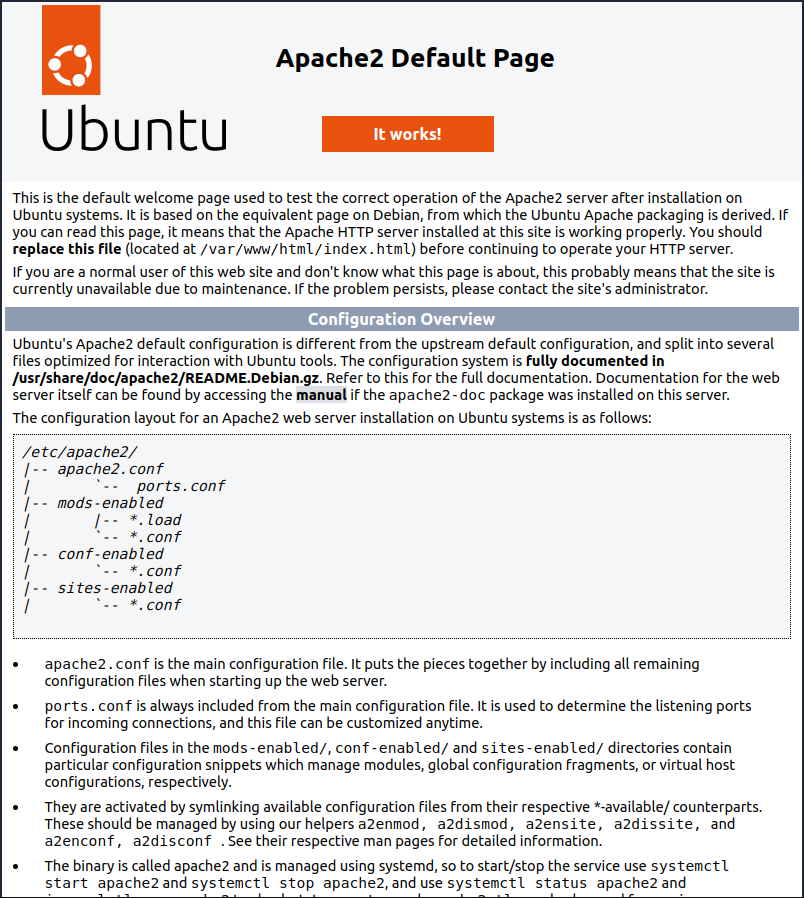

In this episode we will install and configure an **Apache Web Server**. This is free, open source software that is developed and maintained by the Apache Software Foundation and is one of the most widely used web server platforms on the Internet. While most websites use Apache there are alternatives such as Nginx which can provide better performance in cases where a VM is running a single website. In this course we will ultimately setup a single WordPress site so Nginx might be a better solution for us. However, we will use Apache because Nginx is slightly more complicated to administer and requires more effort to configure.

Apache is only one of the components used to run WordPress. All dynamic web applications like WordPress require an entire web service software stack which is traditionally referred to as **LAMP**. **LAMP** stands for the following combination of free open-source software packages:

- **Linux**: A class of operating systems, one of which is Ubuntu which we selected when choosing an image to boot our VM from.

- **Apache**: the web or HTTP server. It receives and delivers requests to and from users who visit your WordPress site.

- **MySQL**: the relational database management system that stores most of the WordPress site content.

- **PHP**: the programming languages used by the WordPress developers to create their web application. PHP uses its processor module to interpret this code which is then used by Apache to generate a resulting web page.

We'll learn how to install and configure the **M** and **P** LAMP components during Day 2, when we finish creating our WordPress sites. At the same time, we'll also learn how to secure our web applications by enabling SSL encryption.

## Installing the Apache web server package

Lets install the Apache web server (or HTTP server) package on our VM. However the `apt` command requires a specific package name to find a specific package name we can search through the packages with

~~~
$ apt search apache
~~~
{: .bash}
~~~
activemq/xenial 5.13.2+dfsg-2 all
  Java message broker - server

adzapper/xenial 20090301.dfsg.1-0.2 all
  proxy advertisement zapper add-on

alpine/xenial 2.20+dfsg1-2 amd64
  Text-based email client, friendly for novices but powerful

alpine-dbg/xenial 2.20+dfsg1-2 amd64
  Text-based email client's debugging symbols

alpine-doc/xenial 2.20+dfsg1-2 all
  Text-based email client's documentation

ant-contrib/xenial 1.0~b3+svn177-7 all
  collection of tasks, types and other tools for Apache Ant

apache2/xenial-updates,xenial-security 2.4.18-2ubuntu3.1 amd64
  Apache HTTP Server

apache2-bin/xenial-updates,xenial-security 2.4.18-2ubuntu3.1 amd64
  Apache HTTP Server (modules and other binary files)

apache2-data/xenial-updates,xenial-security 2.4.18-2ubuntu3.1 all
  Apache HTTP Server (common files)

apache2-dbg/xenial-updates,xenial-security 2.4.18-2ubuntu3.1 amd64
  Apache debugging symbols

apache2-dev/xenial-updates,xenial-security 2.4.18-2ubuntu3.1 amd64
  Apache HTTP Server (development headers)

apache2-doc/xenial-updates,xenial-security 2.4.18-2ubuntu3.1 all
  Apache HTTP Server (on-site documentation)

...
~~~
{: .output}
From this we can see that the package name for the "Apache HTTP Server" is `apache2` and we can use the `apt install` command to install the package.
~~~
$ sudo apt install apache2 -y
~~~
{: .bash}
~~~
Reading package lists... Done
Building dependency tree
Reading state information... Done
The following additional packages will be installed:
  apache2-bin apache2-data apache2-utils libapr1 libaprutil1 libaprutil1-dbd-sqlite3 libaprutil1-ldap liblua5.1-0 ssl-cert
Suggested packages:
  www-browser apache2-doc apache2-suexec-pristine | apache2-suexec-custom openssl-blacklist
The following NEW packages will be installed:
  apache2 apache2-bin apache2-data apache2-utils libapr1 libaprutil1 libaprutil1-dbd-sqlite3 libaprutil1-ldap liblua5.1-0 ssl-cert
0 upgraded, 10 newly installed, 0 to remove and 2 not upgraded.

...
Lots more output...
...

Processing triggers for libc-bin (2.23-0ubuntu7) ...
Processing triggers for systemd (229-4ubuntu16) ...
Processing triggers for ureadahead (0.100.0-19) ...
Processing triggers for ufw (0.35-0ubuntu2) ...
~~~
{: .output}

## Backing up configuration files

Before make any changes to a packages configuration files it is best practise to make a backup of the files. If we make any grievous errors we can return the configuration file back to its original state. This is particularly helpful in the event that we delete information which should never have been removed. One strategy is to create a folder in your home directory and call it `ORIG`. The contents of this directory will represent the original state of files and directories in the root directory `/`. Back up all of your configuration files here and preserve the original paths. In this way the path under the `ORIG` directory will correspond to the path in the `/` directory.

To create the `ORIG` directory in your home directory on the VM use the `mkdir` command which makes a new directory with the options `-pv`. The `p` option will create additional "parent" directories in the path given, if they do not exist. The `v` option will cause the `mkdir` command to be more verbose telling you about all the directories it creates. In our case we want to copy Apache's configuration which is in the `/etc/apache2` directory. To match the path in root we will also create an `etc` directory inside the `ORIG` directory.
~~~
$ mkdir -pv ~/ORIG/etc
~~~
{: .bash}
~~~
mkdir: created directory '/home/ubuntu/ORIG'
mkdir: created directory '/home/ubuntu/ORIG/etc'
~~~
{: .output}

Next we will use the `cp` command to copy the entire contents of the Apache configuration to the `~/ORIG/etc` directory. We will also use the `-a`, or archive, option to preserver permissions, ownership, and timestamp of the files. To allow the preservation of these file attributes correctly administrative permissions are required, thus we use `sudo` to run the `cp` command.
~~~
$ sudo cp -av /etc/apache2 /home/ubuntu/ORIG/etc
~~~
{: .bash}
~~~
'/etc/apache2' -> '/home/ubuntu/ORIG/etc/apache2'
'/etc/apache2/sites-enabled' -> '/home/ubuntu/ORIG/etc/apache2/sites-enabled'
'/etc/apache2/sites-enabled/000-default.conf' -> '/home/ubuntu/ORIG/etc/apache2/sites-enabled/000-default.conf'

...
Lots more files...
...

'/etc/apache2/conf-enabled/security.conf' -> '/home/ubuntu/ORIG/etc/apache2/conf-enabled/security.conf'
'/etc/apache2/conf-enabled/serve-cgi-bin.conf' -> '/home/ubuntu/ORIG/etc/apache2/conf-enabled/serve-cgi-bin.conf'
~~~
{: .output}
What the copy command did was copy the contents of the `apache2` directory, and all subdirectories, to the /home/ubuntu/ORIG/etc directory. Now we can perform configuration modifications in `/etc/apache2` without worrying about making mistakes as we can just restore settings from our copied files.

## Configure a global ServerName

If a global `ServerName` is not configured, Apache will issue a warning message when the configuration files are read. This will happen when you restart your web server or if you check the configuration files. The command `apache2ctl` is used to control the apache web server. It does things like start and stop the web server, report status, and more. The subcommand `configtest` is used to test configuration files for syntax errors and will issue the warning message when executed:

~~~
$ sudo apache2ctl configtest
~~~
{: .bash}
~~~
AH00558: apache2: Could not reliably determine the server's fully qualified domain name, using 127.0.0.1. Set the 'ServerName' directive globally to suppress this message
Syntax OK
~~~
{: .output}

We are going to set the ServerName variable to be the Fully Qualified Domain Name (FQDN) for our virtual machine. The `host` command, given our Floating IP address, will provide us with the FQDN.
~~~
host 206.167.181.126
~~~
{: .bash}
~~~
126.181.167.206.in-addr.arpa domain name pointer 206-167-181-126.cloud.computecanada.ca.
~~~
{: .output}

So the FQDN for the virtual machine is `206-167-181-126.cloud.computecanada.ca`. Use this to set the `ServerName` in the configuration file `/etc/apache2/apache2.conf`.
~~~
sudo nano /etc/apache2/apache2.conf
~~~
{: .bash}
then scroll down to the bottom and add the line`ServerName 206-167-181-126.cloud.computecanada.ca`. The press the ctrl+x keys to exit, making sure to save the edits back to the original file. Then check the configuration files for syntax errors.
~~~
sudo apache2ctl configtest
~~~
{: .bash}
~~~
Syntax OK
~~~
{: .output}

The command `systemctl` is used to control services running on a Ubuntu system. Restart the **apache2** service to enable our changes using the subcommand `restart` and providing the name of the service we want to restart `apache`.
~~~
sudo systemctl restart apache2
~~~
{: .bash}

Using the `systemctl` command again with a different sub command `status` will tell use the status of the named service.
~~~
sudo systemctl status apache2
~~~
{: .bash}
~~~
● apache2.service - LSB: Apache2 web server
   Loaded: loaded (/etc/init.d/apache2; bad; vendor preset: enabled)
  Drop-In: /lib/systemd/system/apache2.service.d
           └─apache2-systemd.conf
   Active: active (running) since Tue 2017-05-02 13:11:26 UTC; 16s ago
     Docs: man:systemd-sysv-generator(8)
  Process: 3354 ExecStop=/etc/init.d/apache2 stop (code=exited, status=0/SUCCESS)
  Process: 3380 ExecStart=/etc/init.d/apache2 start (code=exited, status=0/SUCCESS)
    Tasks: 55
   Memory: 6.3M
      CPU: 55ms
   CGroup: /system.slice/apache2.service
           ├─3398 /usr/sbin/apache2 -k start
           ├─3401 /usr/sbin/apache2 -k start
           └─3402 /usr/sbin/apache2 -k start

May 02 13:11:25 dhsi-testing-temp systemd[1]: Stopped LSB: Apache2 web server.
May 02 13:11:25 dhsi-testing-temp systemd[1]: Starting LSB: Apache2 web server...
May 02 13:11:25 dhsi-testing-temp apache2[3380]:  * Starting Apache httpd web server apache2
May 02 13:11:26 dhsi-testing-temp apache2[3380]:  *
May 02 13:11:26 dhsi-testing-temp systemd[1]: Started LSB: Apache2 web server.
~~~
{: .output}
The line `Active: active (running) since Tue 2017-05-02 13:11:26 UTC; 16s ago` indicates that the service is running.

## Visit the default web page

The apache package installs a default web page to test the installation. This page provides basic information about your apache installation and some tips about how you might modify apache's configuration to suite your needs. After launching your workstation's web browser enter your VM's FQDN into the browsers address bar (we know the FQDN from the previous step: `http://206-167-181-126.cloud.computecanada.ca`). You should see something like the image below.

To create your own web pages you may edit the file `/var/www/html/index.html` which is the default web page shown above. You can use HTML, CSS, and more to create web pages (see [w3schools](https://www.w3schools.com/) for tutorials and references for creating web pages with these technologies).

> ## Static web pages
> At this point you have all the server setup required to create [**static websites**](../reference#static-website). By static website I mean that the contents of the site are display as they are stored on the server. Every visitor of the site sees the same site. For example, this workshop site was generated using a static website generator called [**jekyll**](https://jekyllrb.com/) which is integrated with [github](../reference#github) (a version control web tool). That isn't to say a static website can't have dynamic components. A static website can have features which change based on actions, such as menus which are animated or expandable challenge boxes as shown below. What they can't do is display information which is specific to a person visiting the site, such as shopping carts or account information. Some of the major benefits of static websites is simplicity of setup and maintenance, improved security, and improved performance. If you don't require the functionality of a dynamic site I would highly recommend investigating some of the various static site generators out there. For a good list see: [www.staticgen.com](https://www.staticgen.com/)
{: .callout}

> ## Creating your first web page
>
> Try modifying or replacing the `/var/www/html/index.html` file and see the changes in your browser.
> > ## Solution
> > Edit the file with 
> > ~~~
> > $ sudo nano /var/www/html/index.html
> > ~~~
> > {: .bash}
> > and replace the contents with something like `<h1>My page title
`.
> {: .solution}
{: .challenge}

> ## Add another page
>
> Create a new page under `/var/www/html/` and link to it from the `index.html` page. 
> **Hint**: look at this [w3schools page on HTML links](https://www.w3schools.com/html/html_links.asp).
> > ## Solution
> > Create a new HTML file with
> > ~~~
> > $ sudo nano /var/www/html/another-page.html
> > ~~~
> > {: .bash}
> > Then edit the original file to include a link like `<a href="another-page.html">link</a>` in the `index.html` file referencing your newly created file name.
> {: .solution}
{: .challenge}
