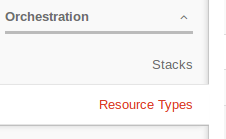

In this episode we will learn how to perform automated cloud environment orchestration. Basically, by the time we're done this episode, we'll see that all the work that we performed during the first two days of the course can actually be accomplished in under 5 minutes by simply executing an **OpenStack Heat template**.

**Heat** is an OpenStack orchestration engine that is used to build entire cloud applications by parsing a declarative template in the form of a text file which is treated as code. These text files are referred to as **HOT** (Heat Orchestration Templates) and they are most commonly saved as human-readable YAML files. In short, they provide us with a method of automating the creation of all cloud components, including key pairs, security groups, security rules, volumes, networks, and virtual machine instances. One key advantage of using Heat is reproducibility. That is to say, in a disaster recovery situation where we would be required to recreate a previous cloud environment, we'd simply execute our template (which is basically an exact recording of the original environment) instead of manually clicking through various web GUI interfaces and potentially guessing at all the settings for our original configuration.

It should be noted that Heat is considered to be a fairly advanced topic and might easily have its own dedicated course in order to cover all of its elements in depth. However, for the sake of this course, in order to get you started, we will introduce some basic information, illustrate some useful examples which you can execute yourself, and provide additional references that you can explore on your own, should you decide to increase your orchestration knowledge and skills.

## Terminology

There are 5 basic components that make up OpenStack Heat. They are as follows:  

- **Resources**: these are cloud objects that will be created or modified during the execution of your template. As previously mentioned, resources include key pairs, security groups, security rules, volumes, networks, and virtual machine instances.  

- **Stacks**: Heat refers to stacks as collections of cloud resources.

- **Parameters**: Heat uses parameters as a means for allowing users to provide various configuration input during the deployment state of template execution. Parameters allow you to reuse your templates in order to construct similar resources with different configuration information. For example, if you wanted to deploy 3 instances, you could use the same template but provide different input parameters for instance name, instance type, etc.  

- **Templates**: templates are used to describe the stack and define the parameters. Another way to refer to a template is *Infrastructure as Code* (*IaC*).  

- **Output**: Heat allows users to define input, as well as output parameters. Use output parameters if you require information about your stack such as private and floating IP addresses, or any additional information about your stack that you would have to look up yourself.   

## Heat Template Components

As previously mentioned, a Heat Template is most commonly a YAML file that contains the following document sections:  

- **Version**: Eash template must include a version key. The version key is specified in the `heat_template_version` field and it indicates both the format of the template and which features are validated and supported. In general, the version key is specified using either the date or code name of the Heat release. For example, for our course, since Arbutus is currently running OpenStack Kilo, we will specify the template version as `2015-04-30`. For more information about HOT versions, see [Heat template version](https://docs.openstack.org/developer/heat/template_guide/hot_spec.html#hot-spec-template-version).

- **Description**: This is also a required section. It simply allows you to provide a brief explanation about the stack you are creating.

- **Parameters**: This is an optional section. It provides a mechanism for users to specify various input parameters that are required to be provided during the template instantiation stage. These parameters are used to customize each deployment and, in order to fully automate the process, default values can be specified parameter. Parameters are defined in separate nested YAML blocks as follows:

~~~
parameters:
  parameter_name:
    type: string | number | json | comma_delimited_list | boolean
    label: human-readable name of the parameter
    description: description of the parameter
    default: default value for parameter
    hidden: true | false
    constraints:
      - parameter constraint 1
    immutable: true | false
~~~
{: .YAML}    

Supported parameter types include: number, comma_delimited_list, json and boolean. Default values are used when a users don't specify their own values during deployment. You can declare parameters to be hidden, if you require that certain information should not be revealed upon request (such as passwords, etc). Constraints are rules that are validated by the OpenStack Heat engine during deployment. These rules might include valid instance types, images, number ranges, string length, string pattern, etc. If a specified parameter value violates a constraint, then the stack creation will fail. Finally, you can define whether or not you can later revise parameters by specifying the immutable field.  

- **Resources**: This section defines the actual resources that comprise the stack deployed from an OpenStack Heat template. Similar to parameters, resources are defined in separate nested YAML blocks as follows:

~~~
resources:
  resource_id:
    type: resource type
    properties:
      property_name_1: property value 1
      ...
    metadata:
      <resource specific metadata>
    depends_on: resource ID / list of resource IDs
    update_policy: dictionary of update policies
    deletion_policy: deletion policy
    external_id: external resource ID
    condition: condition name, expression, or boolean
~~~
{: .YAML}    

The most important field is resource `type`. This is a required field and it specified what kind of cloud entity that will be deployed. Really, the most effective way to explain the resource section is to create, execute, and then deconstruct a few basic examples - which we will do in subsequent sections. In the meantime, you can find out more about resource types by using the Web GUI interface, clicking on Orchestration and then Resource Types in the menu.

  

- **Outputs**: Again, these are outputs that provide information back to the user. The syntax for each output is similar to that used to specify an input parameter. We will include the output section in our first sample Heat template.  

## Creating Your First HOT

To review the only required sections are: version, description, and resources. But it's import to illustrate all 5 sections in order to better understand how Heat works. The example listed below is a very basic template that creates and launches a simple virtual machine instance.

~~~
heat_template_version: 2015-04-30

description: Simple HOT that deploys a virtual machine instance

parameters:
  key_name:
    type: string
    label: Key Pair Name
    description: Name of the key-pair used to log into the VM
    default: yoga3pro

  image_id:
    type: string
    label: Image ID
    description: Image used to deploy the VM
    default: Ubuntu-16.04-Xenial-x64-2017-03

  flavor:
    type: string
    label: Instance Type
    description: Instance type used to deploy the VM
    default: p2-3gb

resources:
  heat_vm:
    type: OS::Nova::Server
    properties:
      key_name: { get_param: key_name }
      image: { get_param: image_id }
      flavor: { get_param: flavor }

outputs:
  instance_ip:
    description: IP Address of the deployed VM
    value: { get_attr: [heat_vm, first_address] }
~~~
{: .YAML}

So, in a nutshell, here's what's happening:  

- First, I specified a heat template version that would be compatible with the version of OpenStack running on Arbutus.  

- Then I wrote a brief description that summarizes what this template does.  

- Next, I defined three parameters which describe the key pair, image, and flavor that I want to use for my instance and I assigned appropriate default values for Arbutus. (If, for example, I wanted to reuse this template to launch an instance on East Cloud, I would simply input values which were appropriate for that cluster and I wouldn't otherwise have to rewrite any sections of this template.)  

- After that, I defined my virtual machine resource and assigned appropriate properties required to launch the instance.  

- Finally, I defined an output which reported the IP address which was assigned to my VM.

## Executing Your First Stack

Now that I have written my first template, I need to figure out how to execute it. The easiest method is to launch a stack using the Web Gui interface. You should already know how to log into the Web interface for Arbutus. Once there, select `Orchestration` and then click `Stacks` in the main menu. (See figure from previous section.)  

NOTE from here to below is rough draft....

In the Stacks window, click `Launch Stack`.

[figure]

In the Select Template window ensure the following:

- Template Source: file

- Template file: ....

Then click Next

[figure]

In the Launch Stack window, provide a name for this stack, enter the password for your Arbutus account, and then review the default values for Instance Type, Image ID, and Key Pair Name. If you are satisfied click Launch.  

[figure]

Finish this when I get home...

Still need an outputs screen shot

## Deleting Your First Stack

## Illustrating and Executing and Example WordPress HOT

## Where to Find Additional Heat Information
