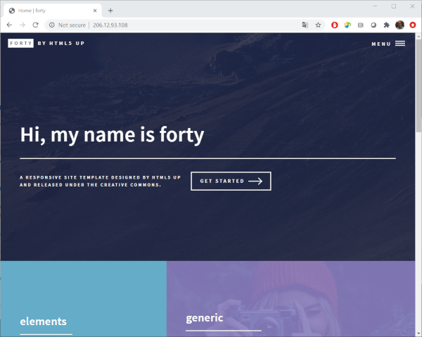

Lets create our first site using a pre-made custom theme so it looks nicer than the built in standard Jekyll theme. There are a number of places to find Jekyll themes:

* [jamstackthemes.dev](http://jamstackthemes.dev)
* [jekyllthemes.org](http://jekyllthemes.org)
* [jekyllthemes.io](http://jekyllthemes.io)
* [jekyll-themes.com](http://jekyll-themes.com)

I found one I like on [jekyllthemes.io](http://jekyllthemes.io), called [Forty](https://jekyllthemes.io/theme/forty-jekyll-theme), lets use this theme.

To use it we need to download it onto our VM. In order to do that we need to get a URL to download it from. A little bit lower on the page there is a link that says "Get Forty on GitHub". If we click that it will take us to the theme's github page. We can get a download URL from there by clicking the "Code" drop down box, right clicking on the "Download ZIP" link and selecting "Copy link address".

Now we can download it to our VM by using the <code>wget</code> command and pasting the link we copied to our clip board into our SSH terminal on our VM. Then unzip the newly downloaded file and change into that directory.
<!--TODO: might want to mv the unzipped directory to a new name that is more meaning for their site?-->
~~~
$ wget https://github.com/andrewbanchich/forty-jekyll-theme/archive/master.zip
$ unzip master.zip
$ cd forty-jekyll-theme-master
~~~
{: .bash}

> ## Gem based themes
> Gem based themes can be installed like regular Ruby gems using the `gem` command. Gem based themes will hide much of the themes styling and layouts in a separate directory for the gem. Only the directories and files required to add content your site are present in the sites directory.
{: .callout}

There are a few minor configuration settings we have to make in order for that theme to work with our webserver. Confirugation settings for Jekyll sites are generally in the `_config.yml` file. This is a YAML file (YAML Ain't Markup Language) (see: [yaml.org](https://yaml.org/)). Very briefly, a YAML file is a way of specifying key value pairs in a standardized format so that computer programs and people can easily read them. These key value pairs have a format like <code>key</code><code>:</code><code>value</code>, where the key name and it's value are separated by a colon, <code>:</code>. In addition, lines which begin with a `#` are comment lines. These lines add useful information for people reading and editing these YAML files but are usually ignored by programs reading these files.

~~~
$ nano _config.yml
~~~
{: .bash}
~~~
# site settings
title: Forty
.
.
.
baseurl: "/forty-jekyll-theme" # the subpath of your site, e.g. /blog
.
.
.
~~~
{: .output}
To have the site generate correctly we only need to change one value, for the key: <code>baseurl</code>. This value tells the site how to find things within its own site. Initially this has the value <code>/forty-jekyll-theme</code>. This tells the site that it is located in the directory "forty-jekyll-theme" in the root directory of our web site. In our case our root directory is <code>/var/www/html</code> on our VM and we are actually going to put our site directly into that directory. So we need to set the key <code>baseurl</code> to have an empty string as a value. Edit the <code>_config.yml</code> file to look like this:
~~~
# site settings
title: Forty
.
.
.
baseurl: "" # the subpath of your site, e.g. /blog
.
.
.
~~~
{: .output}
Then save the and exit the editor.

Now lets install the gems that this site requires and publish it to our VM's websites root directory.
~~~
$ bundle install
$ jekyll build -d /var/www/html/
~~~
{: .bash}

The first command, <code>bundle</code>, installs the gems required by the site. These gems are defined in the <code>Gemfile</code> file. The second lines actualy generates the site from the contents of the current working directory and places the newly created site in the <code>/var/www/html</code> directory.

Finally visit your new site at your VM's IP address in your browser to see your new Jekyll site.

> ## Gemfiles and gemspec
> Bundler uses Gemfiles to specify where to download gems using a line starting with <code>source</code> with the URL to download the gems from afterwards. This line is followed by lines listing the names of the gems to install. Sometimes Gemfiles specify the requirements in separate files ending with ".gemspec". This is indicated by a line <code>gemspec</code> in the Gemfile. Gemspec files are used to specify attributes and requirements for gems. You can read more about Bundler Gemfiles [here](https://bundler.io/gemfile.html), and about the use of <code>gemspec</code> in Gemfiles [here](https://bundler.io/rubygems.html).
{: .callout}

<!--
> ## Automatically rebuild your site when files are updated
> The jekyll <code>build</code> command can be run with a <code>-w</code> option. This option will keep this command running in the terminal watching for any files to change. If it notices one change, it will automatically rebuild your site. This can be very handy when performing many frequent edits. The complete command might look like:
>~~~
>$ jekyll build -w -d <website_root_directory>
>~~~
>{: .bash}
{: .callout}
-->
