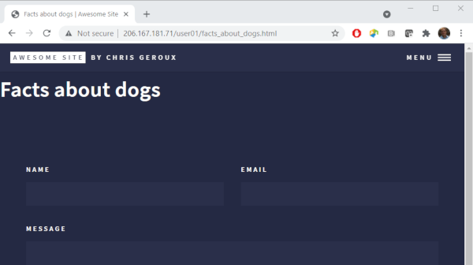

# Modify an existing page
We are starting to get our site looking a little more like our own, but what are these **Elements**, **Generic**, and **Landing** on our home page? If we click on them we are taken to a new page for each. The elements page shows off some of the different standard HTML elements and how they have been styled with this theme. We can also navigate to these three different pages with the *MENU* in the top right of the page.

Lets have a look in our sites source directory again to see if we can find out where these items are coming from.

~~~
$ ls -l
~~~
{: .bash}
~~~
total 100
-rw-rw-r-- 1 user01 user01    68 Sep  2 03:50 404.md
-rw-rw-r-- 1 user01 user01   693 Sep  2 03:50 CONTRIBUTING.md
-rw-rw-r-- 1 user01 user01   120 Sep  2 03:50 Gemfile
-rw-rw-r-- 1 user01 user01  1656 Sep 20 20:07 Gemfile.lock
-rw-rw-r-- 1 user01 user01 17065 Sep  2 03:50 LICENSE.md
-rw-rw-r-- 1 user01 user01  2939 Sep  2 03:50 README.md
-rw-rw-r-- 1 user01 user01  1094 Sep 21 17:33 _config.yml
drwxrwxr-x 2 user01 user01  4096 Sep  2 03:50 _includes
drwxrwxr-x 2 user01 user01  4096 Sep  2 03:50 _layouts
drwxrwxr-x 2 user01 user01  4096 Sep  2 03:50 _posts
drwxrwxr-x 6 user01 user01  4096 Sep  2 03:50 _sass
-rw-rw-r-- 1 user01 user01   164 Sep  2 03:50 all_posts.md
drwxrwxr-x 6 user01 user01  4096 Sep  2 03:50 assets
-rw-rw-r-- 1 user01 user01 15750 Sep  2 03:50 elements.md
-rw-rw-r-- 1 user01 user01   650 Sep  2 03:50 forty_jekyll_theme.gemspec
-rw-rw-r-- 1 user01 user01  1645 Sep  2 03:50 generic.md
-rw-rw-r-- 1 user01 user01   168 Sep 21 17:16 index.md
-rw-rw-r-- 1 user01 user01  3544 Sep  2 03:50 landing.md
~~~
{: .output}

There are files matching these three items appearing on the home page of our site. Lets look inside the `elements.md` file.

~~~
$ nano elements.md
~~~
{: .bash}
~~~
---
layout: page
title: Elements
nav-menu: true
---

<!-- Main -->

<!-- One -->
<section id="one">
        

.
.
.
~~~
{: .output}

You will notice at the top of this file the YAML section specifying the layout similarly to when we looked at the `index.md` file, however this time the layout value is `page` rather than `home`. This is a layout that the theme provides for general pages on your site. 

From the official Jekyll documentation on [pages](https://jekyllrb.com/docs/pages/):
> Pages are the most basic building block for content. They’re useful for standalone content (content which is not date based or is not a group of content such as staff members or recipes).

Lets try changing both the `title` and the `nav-menu:` items and see what happens.
~~~
---
layout: page
title: Elements new title
nav-menu: false
---

<!-- Main -->

<!-- One -->
<section id="one">
        

.
.
.
~~~
{: .output}
Save and exit nano and then regenerate our site to see the results.
~~~
$ jekyll build -d /var/www/html/<your-username>
~~~
{: .bash}

If we look in the menu in the top right of the page, we will also see that 'ELEMENTS' entry has been removed, but it hasn't been replaced with our new title 'ELEMENTS NEW TITLE'. This is because we set `nav-menu` to `false`.

It is important to note, that while the `layout` key is common to all Jekyll sites (telling Jekyll what layout to use when processing the site) many other keys are theme specific. In our case `nav-menu` and `title` are both used by our theme to customize how it displays content and while `title` is a fairly common key to many themes, exactly how they use it can differ. To learn about the keys your theme uses, there can sometimes be documentation, for example in our case there is a `README.md` file which contains some documentation which we can view on the theme's [github page](https://github.com/andrewbanchich/forty-jekyll-theme) (however nothing about these keys specifically). Usually theme documentation on its own is inadequate and the authors instead provide examples of the theme's usage within the theme its self. Looking at the files, as we have been doing, is often best way to see how individual themes work. We have already been learning about our theme in this way by looking in files that came with it, modifying settings and seeing what happens. We may well discover other useful `keys` we can set for this theme in other files.

If we click on the "Elements new title" tile, and go to the page we actually don't see our new title but instead the original contents of the page. That's because the new title key isn't actually used on the page, but rather on the home page to create those tiles. The title that appears on the page comes from the HTML in the page content in the `elements.md` file rather than the front matter. The content of pages can be Markdown or HTML or a mixture of both.

## Creating a new page

Pages can be created by creating a new HTML or markdown file in the site's source directory or by creating sub-directories and place the pages in those directories. In the generated site those pages will appear in the same sub-directories as they are in the source directory.

Lets create a new page called "Facts about dogs" by creating a new markdown file and add the page front matter. Markdown files typically have an `.md` suffix to indicate that they are markdown files.

~~~
$ nano facts_about_dogs.md
~~~
{: .bash}
~~~
---
layout: page
title: Facts about dogs
nav-menu: true
---
~~~
{: .output}

To add content to our page we need to use markdown, but until now we haven't talked about how to write markdown, so now is the time.

## Markdown

Markdown was designed to be easily readable by humans but also for it to be possible for computers to read it. People have been formatting [plain text](https://en.wikipedia.org/wiki/Plain_text) to convey meaning for a long time. I remember learning about some of these methods back in my high-school typing classes, for example
~~~
=============================
S E C T I O N   H E A D I N G
=============================

Body of the section here...
~~~
{: .output}

However, these practices were not really standardized which makes it particularly problematic for telling a computer how to interpret them. Markdown was an attempt to solve that issue by imposing some standardization on how to format plain text to be readable by people and also machines. The main purpose of Markdown was to be an easier to read alternative to HTML and as such there are many tools that allow you to convert Markdown to HTML, for example this one [markdowntohtml.com](https://markdowntohtml.com/).

### Headers

In markdown you can create headings in two ways using "underlines", which require an empty line above,

~~~

Top level Header
===========

Sub header
----------
~~~
{: .output}

> Top Header
> ===========
> 
> Sub header
> ----------
{: .output}

or using the 1-6 `#` character with the number of `#` characters indicating the level of the header.
~~~
# Top level header
## Second level header
.
.
.
###### Sixth level header
~~~
{: .output}

> # Top level header
> ## Second level header
> ###### Sixth level header
{: .output}

Any number of `=` and `-` work will work.

So with that lets add our title to the page.
~~~
---
layout: page
title: Facts about dogs
nav-menu: true
---

# Facts about dogs
~~~
{: .output}
Save and exit the file and rebuild our site.
~~~
$ jekyll build -d /var/www/html/<your-username>
~~~
{: .bash}

## Automatically rebuild site
I don't know about you, but I am starting to get tired of having to exit the editor and rebuild our site each time. Wouldn't it be nice if there was some way to do this automatically? Well it turns out the authors of Jekyll also got tired of it and added a "-w" option to the build command, which tells the command to keep running and watch for changes to files and rebuild the site if they see any change.

Lets open a new terminal, ssh into the VM, and run our Jekyll build command there with the `-w` option so we can edit our file and have our site automatically rebuild as we save our changes.

~~~
$ ssh ssh <username>@<remote-ip>
~~~
{: .bash}
~~~
Welcome to Ubuntu 20.04.2 LTS (GNU/Linux 5.4.0-73-generic x86_64)

 * Documentation:  https://help.ubuntu.com
 * Management:     https://landscape.canonical.com
 * Support:        https://ubuntu.com/advantage
...
~~~
{: .output}

In our new terminal, first change into our site's source directory and run our build command with the new option.
~~~
$ cd forty-jekyll-theme-master
$ jekyll build -d /var/www/html/<your-username> -w
~~~
{: .bash}
Now as we make changes our site will be automatically recreated to view the changes we make in our editor all we have to do now is refresh our browser.

## More Markdown
### Lists
Since this is a page entitled "Facts about dogs" it seems like we might actually want to list some facts about dogs. Markdown supports two types if lists unordered and ordered lists.

To make an unordered list  you can indicate each separate list item with a `*`, `+`, or `-` marker. The list item markers must be separated from the list item content by a space.
~~~
* Bird
+ Cat
- Dog
~~~
{: .output}
> * Bird
> + Cat
> - Dog
{: .output}
You of course don't have to mix them up like this, but you can. Order lists are created with starting each line with a number followed by a period, `.` and a space.
~~~
3. Bird
1. Cat
1. Dog
~~~
{: .output}
> 3. Bird
> 1. Cat
> 1. Dog
{: .output}
The numbers don't have to go in order in the markdown or be unique but they will increase by one each item in the resulting HTML. Often it is a good idea though to choose the numbers in the markdown to be consistent with the rendered HTML output.

You can also nest and combine ordered and unordered lists.
~~~
* Birds
  1. Blue Jay
  2. Chickadee
* Cat
  1. Tabby
  2. Tiger
* Dog
  1. Lab
  2. Begal
~~~
{: .output}
> * Birds
>   1. Blue Jay
>   2. Chickadee
> * Cat
>   1. Tabby
>   2. Tiger
> * Dog
>   1. Lab
>   2. Begal
{: .output}
To indicate that a list should be inside a particular list item it must be indented at least two spaces. 

Now that we know a bit about lists, lets add a list of facts to our page and see the result.
~~~
---
layout: page
title: Facts about dogs
nav-menu: true
---

# Facts about dogs
* Dogs noses are wet to help absorb scent chemicals
* Your dog is as smart as a two-year old
* Seeing eye dogs are trained to poop on command
* Dogs can be trained to detect cancer
* Spiked dog collars were originally designed in ancient Greece to protect dogs' throats from wolf attacks.
~~~
{: .output}

The save the changes (`ctrl`+`O`) and refresh your browser.

> ## Add a second level heading
> Try adding a second level heading to the page.
> 
> > ## Solution
> > `## new heading`
> {: .solution}
{: .challenge}

> ## Add an ordered list
> Try adding an ordered list to your page.
> 
> > ## Solution
> > `2. Thing one` 
> > `1. Thing two` 
> > `3. Thing three` 
> {: .solution}
{: .challenge}