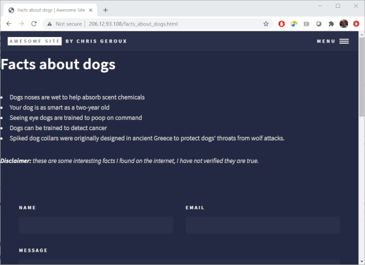
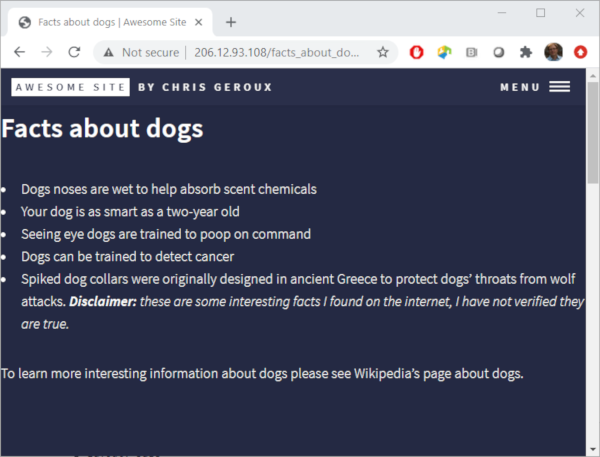
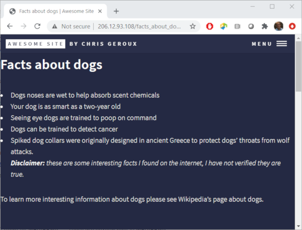

### Emphasis
Disclaimer, these facts are some interesting things I read quickly on the internet, they may or may not be true! Actually, lets add that text to our site letting our readers of the site know this too.

~~~
---
layout: page
title: Facts about dogs
nav-menu: true
---

# Facts about dogs
* Dogs noses are wet to help absorb scent chemicals
* Your dog is as smart as a two-year old
* Seeing eye dogs are trained to poop on command
* Dogs can be trained to detect cancer
* Spiked dog collars were originally designed in ancient Greece to protect dogs' throats from wolf attacks.

Disclaimer: these are some interesting facts I found on the internet, I have not verified they are true.
~~~
{: .output}

Save the changes and refresh your browser to have a look at the changes. That looks OK, but I think it would be better if the `Disclaimer` text was bold. To make text bold you enclose it in double stars `**`.

~~~
.
.
.
**Disclaimer:** these are some interesting facts I found on the internet, I have not verified they are true.
~~~

Text can also be made italic with a single star `*` and bold and italic with triple stars. I think I would like the whole disclaimer line to be italic and the first disclaimer text to be bold and italic.
~~~
.
.
.
***Disclaimer:** these are some interesting facts I found on the internet, I have not verified if they are true.*
~~~
{: .output}

Emphasis can be thought of different escalating levels of emphasis. A single star `*` is the first level of emphasis, italic. Two stars `**` is the second level of emphasis, bold. The final third level is bold and italic combined indicated with three stars `***`. We start the above line with bold and italic text with three stars `***`, then after our `Disclaimer:` text we decrease the emphasis level by two stars, `**` to italic. The rest of the line is then italic until we get to the final star, ending all the emphasis levels and returning to normally formatted text.

### Paragraphs

Now we want to write some more text on our page, but we want it to be separate from the disclaimer we just wrote. This can be done by making it a separate paragraph. We have actually already made a new paragraph on our page after our list for our disclaimer. New paragraphs are started with an empty line. Lets start a new paragraph on our page and make our disclaimer part of the paragraph the list is part of.

~~~
---
layout: page
title: Facts about dogs
nav-menu: true
---

# Facts about dogs
* Dogs noses are wet to help absorb scent chemicals
* Your dog is as smart as a two-year old
* Seeing eye dogs are trained to poop on command
* Dogs can be trained to detect cancer
* Spiked dog collars were originally designed in ancient Greece to protect dogs' throats from wolf attacks.
***Disclaimer:** these are some interesting facts I found on the internet, I have not verified they are true.*

To learn more interesting information about dogs please see Wikipedia's page about dogs.
~~~
{: .output}

Ok, so removing the paragraph after the list didn't work like we wanted. It made it a part of the last list item. If we could put the Disclaimer on new line, but not a new paragraph we might get the result we are looking for.

> ## Don't indent your paragraphs
> Indenting your paragraphs could result in unexpected formatting problems.
{: .callout}

### Line breaks
We can do this with a line break. A line break is indicated with two or more spaces. Lets add two spaces to the end of the last line in our list.

### Links

Lets get back to the text we started writing after our list of facts and disclaimer. It would be really nice for the readers of our page if we could direct them to the Wikipedia page we are thinking of, rather than hoping they find the one we are thinking of. This is of course done with a link. Links are the driving force of the web making it possible to navigate between pages and sites with the click of a mouse. Adding a link on our page to the Wikipedia article for dogs looks like this
~~~
.
.
.

To learn more interesting information about dogs please see [Wikipedia's page about dogs](https://en.wikipedia.org/wiki/Dog).
~~~
{: .output}
The text between the square brackets `[` `]` is the link text that will be displayed on our page, and the URL between the curved brackets `(` `)` is the address of the page we wish to direct our readers to.
