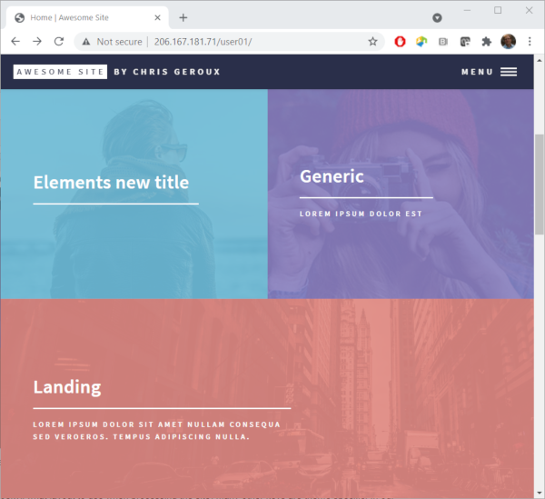
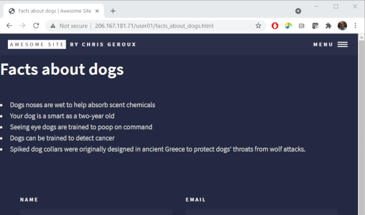

We are starting to get our site looking a little more like our own, but what are these **Elements**, **Generic**, and **Landing** on our home page? If we click on them we are taken to a new page for each. The elements page shows off some of the different standard HTML elements and how they have been styled with this theme. We can also navigate to these three different pages with the *MENU* in the top right of the page.

Lets have a look in our sites source directory again to see if we can find out where these items are coming from.

~~~
$ ls -l
~~~
{: .bash}
~~~
-rw-rw-r-- 1 ubuntu ubuntu    68 Jun 27 16:29 404.md
-rw-rw-r-- 1 ubuntu ubuntu   693 Jun 27 16:29 CONTRIBUTING.md
-rw-rw-r-- 1 ubuntu ubuntu    38 Jun 27 16:29 Gemfile
-rw-rw-r-- 1 ubuntu ubuntu  1646 Sep 11 19:00 Gemfile.lock
-rw-rw-r-- 1 ubuntu ubuntu 17065 Jun 27 16:29 LICENSE.md
-rw-rw-r-- 1 ubuntu ubuntu  2886 Jun 27 16:29 README.md
-rw-rw-r-- 1 ubuntu ubuntu   922 Sep 11 18:58 _config.yml
drwxrwxr-x 2 ubuntu ubuntu  4096 Jun 27 16:29 _includes
drwxrwxr-x 2 ubuntu ubuntu  4096 Jun 27 16:29 _layouts
drwxrwxr-x 2 ubuntu ubuntu  4096 Jun 27 16:29 _posts
drwxrwxr-x 6 ubuntu ubuntu  4096 Jun 27 16:29 _sass
-rw-rw-r-- 1 ubuntu ubuntu   164 Jun 27 16:29 all_posts.md
drwxrwxr-x 6 ubuntu ubuntu  4096 Jun 27 16:29 assets
-rw-rw-r-- 1 ubuntu ubuntu 15719 Jun 27 16:29 elements.md
-rw-rw-r-- 1 ubuntu ubuntu   650 Jun 27 16:29 forty_jekyll_theme.gemspec
-rw-rw-r-- 1 ubuntu ubuntu  1645 Jun 27 16:29 generic.md
-rw-rw-r-- 1 ubuntu ubuntu   536 Jun 27 16:29 index.md
-rw-rw-r-- 1 ubuntu ubuntu  3544 Jun 27 16:29 landing.md
~~~
{: .output}

There are files matching these three items appearing on the home page of our site. Lets look inside the `elements.md` file.
<!--Should I have them create a saved version before we start editing it? It shows how to do a bunch of html stuff with this theme and might be good to keep for reference?-->
~~~
$ nano elements.md
~~~
{: .bash}
~~~
---
layout: page
title: Elements
nav-menu: true
---

<!-- Main -->

<!-- One -->
<section id="one">
        

.
.
.
~~~
{: .output}

You will notice at the top of this file the YAML section specifying the layout similarly to when we looked at the `index.md` file, however this time the layout value is `page` rather than `home`. This is a layout that the theme provides for general pages on your site. 

From the official Jekyll documentation on [pages](https://jekyllrb.com/docs/pages/):
> Pages are the most basic building block for content. They’re useful for standalone content (content which is not date based or is not a group of content such as staff members or recipes).

Pages can be created by creating a new HTML or markdown file in the site's source directory or by creating sub-directories and place the pages in those directories. In the generated site those pages will appear in the same sub-directories as they are in the source directory.

Lets try changing both the `title` and the `nav-menu:` items and see what happens.
~~~
---
layout: page
title: Elements new title
nav-menu: false
---

<!-- Main -->

<!-- One -->
<section id="one">
        

.
.
.
~~~
{: .output}
Save and exit nano and then regenerate our site to see the results.
~~~
$ jekyll build -d /var/www/html
~~~
{: .bash}

If we look in the menu in the top right of the page, we will also see that 'ELEMENTS' entry has been removed, but it hasn't been replaced with our new title 'ELEMENTS NEW TITLE'. This is because we set `nav-menu` to `false`.

It is important to note, that while the `layout` key is common to all Jekyll sites (telling Jekyll what layout to use when processing the site) many other keys are theme specific. In our case `nav-menu` and `title` are both used by our theme to customize how it displays content and while `title` is a fairly common key to many themes, exactly how they use it can differ. To learn about the keys your theme uses, there can sometimes be documentation, for example in our case there is a `README.md` file which contains some documentation which we can view on the theme's [github page](https://github.com/andrewbanchich/forty-jekyll-theme) (however nothing about these keys specifically). Usually theme documentation on its own is inadequate and the authors instead provide examples of the theme's usage within the theme its self. Looking at the files, as we have been doing, is often best way to see how individual themes work. We have already been learning about our theme in this way by looking in files that came with it, modifying settings and seeing what happens. We may well discover other useful `keys` we can set for this theme in other files.

If we click on the "Elements new title" tile, and go to the page we actually don't see our new title but instead the original contents of the page. That's because the new title key isn't actually used on the page, but rather on the home page to create those tiles.

<!--
But first lets stop the elements page from being included in our site. We can do that by prepending an `_` (underscore) to the file name.
~~~
$ mv elements.md _elements.md
~~~
{: .bash}
This way the file won't be included as a page in our final site, but if we want to later look at the content that originally came with the theme we can.
-->

Lets create a new page called "Facts about dogs" by creating a new markdown file and add the page front matter.
~~~
$ nano facts_about_dogs.md
~~~
{: .bash}
~~~
---
layout: page
title: Facts about dogs
nav-menu: true
---
~~~
{: .output}

To add content to our page we need to use markdown, but until now we haven't talked about how to write markdown, so now is the time.

## Markdown

Markdown was designed to be easily readable by humans but also for it to be possible for computers to read it. People have been formatting [plain text](https://en.wikipedia.org/wiki/Plain_text) to convey meaning for a long time. I remember learning about some of these methods back in my high-school typing classes, for example
~~~
=============================
S E C T I O N   H E A D I N G
=============================

Body of the section here...
~~~
{: .output}

However, these practices were not really standardized which makes it particularly problematic for telling a computer how to interpret them. Markdown was an attempt to solve that issue by imposing some standardization on how to format plain text to be readable by people and also machines. The main purpose of Markdown was to be an easier to read alternative to HTML and as such there are many tools that allow you to convert Markdown to HTML, for example this one [markdowntohtml.com](https://markdowntohtml.com/).

### Headers

In markdown you can create headings in two ways using "underlines", which require an empty line above,

~~~

Top level Header
===========

Sub header
----------
~~~
{: .output}

> Top Header
> ===========
> 
> Sub header
> ----------
{: .output}

or using the 1-6 `#` character with the number of `#` characters indicating the level of the header.
~~~
# Top level header
## Second level header
.
.
.
###### Sixth level header
~~~
{: .output}

> # Top level header
> ## Second level header
> ###### Sixth level header
{: .output}

Any number of `=` and `-` work will work.

So with that lets add our title to the page.
~~~
---
layout: page
title: Facts about dogs
nav-menu: true
---

# Facts about dogs
~~~
{: .output}
Save and exit the file and rebuild our site.
~~~
$ jekyll build -d /var/www/html
~~~
{: .bash}
I don't know about you, but I am starting to get tired of having to exit the editor and rebuild our site each time. Wouldn't it be nice if there was some way to do this automatically? Well it turns out the authors of Jekyll also got tired of it and added a "-w" option to the build command, which tells the command to keep running and watch for changes to files and rebuild the site if they see any change. Lets open a new terminal and run our Jekyll build command there with the `-w` option so we can edit our file and have our site automatically rebuild. In our new terminal, first change into our site's source directory and run our build command with the new option.
~~~
$ cd forty-jekyll-theme-master
$ jekyll build -w -d /var/www/html
~~~
{: .bash}
Now as we make changes our site will be automatically recreated to view the changes we make in our editor all we have to do now is refresh our browser.

### Lists
Since this is a page entitled "Facts about dogs" it seems like we might actually want to list some facts about dogs. Markdown supports two types if lists unordered and ordered lists.

To make an unordered list  you can indicate each separate list item with a `*`, `+`, or `-` marker. The list item markers must be separated from the list item content by a space.
~~~
* Bird
+ Cat
- Dog
~~~
{: .output}
> * Bird
> + Cat
> - Dog
{: .output}
You of course don't have to mix them up like this, but you can. Order lists are created with starting each line with a number followed by a period, `.` and a space.
~~~
3. Bird
1. Cat
1. Dog
~~~
{: .output}
> 3. Bird
> 1. Cat
> 1. Dog
{: .output}
The numbers don't have to go in order in the markdown or be unique but they will increase by one each item in the resulting HTML. Often it is a good idea though to choose the numbers in the markdown to be consistent with the rendered HTML output.

You can also nest and combine ordered and unordered lists.
~~~
* Birds
  1. Blue Jay
  2. Chickadee
* Cat
  1. Tabby
  2. Tiger
* Dog
  1. Lab
  2. Begal
~~~
{: .output}
> * Birds
>   1. Blue Jay
>   2. Chickadee
> * Cat
>   1. Tabby
>   2. Tiger
> * Dog
>   1. Lab
>   2. Begal
{: .output}
To indicate that a list should be inside a particular list item it must be indented at least two spaces. 

Now that we know a bit about lists, lets add a list of facts to our page and see the result.
~~~
---
layout: page
title: Facts about dogs
nav-menu: true
---

# Facts about dogs
* Dogs noses are wet to help absorb scent chemicals
* Your dog is as smart as a two-year old
* Seeing eye dogs are trained to poop on command
* Dogs can be trained to detect cancer
* Spiked dog collars were originally designed in ancient Greece to protect dogs' throats from wolf attacks.
~~~
{: .output}

### Emphasis
Disclaimer, these facts are some interesting things I read quickly on the internet, they may or may not be true! Actually, lets add that text to our site letting our readers of the site know this too.

~~~
---
layout: page
title: Facts about dogs
nav-menu: true
---

# Facts about dogs
* Dogs noses are wet to help absorb scent chemicals
* Your dog is as smart as a two-year old
* Seeing eye dogs are trained to poop on command
* Dogs can be trained to detect cancer
* Spiked dog collars were originally designed in ancient Greece to protect dogs' throats from wolf attacks.

Disclaimer: these are some interesting facts I found on the internet, I have not verified they are true.
~~~
{: .output}

Save the changes and refresh your browser to have a look at the changes. That looks OK, but I think it would be better if the `Disclaimer` text was bold. To make text bold you enclose it in double stars `**`.

~~~
.
.
.
**Disclaimer:** these are some interesting facts I found on the internet, I have not verified they are true.
~~~

Text can also be made italic with a single star `*` and bold and italic with triple stars. I think I would like the whole disclaimer line to be italic and the first disclaimer text to be bold and italic.
~~~
.
.
.
***Disclaimer:** these are some interesting facts I found on the internet, I have not verified if they are true.*
~~~
{: .output}

Emphasis can be thought of different escalating levels of emphasis. A single star `*` is the first level of emphasis, italic. Two stars `**` is the second level of emphasis, bold. The final third level is bold and italic combined indicated with three stars `***`. We start the above line with bold and italic text with three stars `***`, then after our `Disclaimer:` text we decrease the emphasis level by two stars, `**` to italic. The rest of the line is then italic until we get to the final star, ending all the emphasis levels and returning to normally formatted text.

### Paragraphs

Now we want to write some more text on our page, but we want it to be separate from the disclaimer we just wrote. This can be done by making it a separate paragraph. We have actually already made a new paragraph on our page after our list for our disclaimer. New paragraphs are started with an empty line. Lets start a new paragraph on our page and make our disclaimer part of the paragraph the list is part of.

~~~
---
layout: page
title: Facts about dogs
nav-menu: true
---

# Facts about dogs
* Dogs noses are wet to help absorb scent chemicals
* Your dog is as smart as a two-year old
* Seeing eye dogs are trained to poop on command
* Dogs can be trained to detect cancer
* Spiked dog collars were originally designed in ancient Greece to protect dogs' throats from wolf attacks.
***Disclaimer:** these are some interesting facts I found on the internet, I have not verified they are true.*

To learn more interesting information about dogs please see Wikipedia's page about dogs.
~~~
{: .output}

Ok, so removing the paragraph after the list didn't work like we wanted. It made it a part of the last list item. If we could put the Disclaimer on new line, but not a new paragraph we might get the result we are looking for.

> ## Don't indent your paragraphs
> Indenting your paragraphs could result in unexpected formatting problems.
{: .callout}

### Line breaks
We can do this with a line break. A line break is indicated with two or more spaces. Lets add two spaces to the end of the last line in our list.

### Links

Lets get back to the text we started writing after our list of facts and disclaimer. It would be really nice for the readers of our page if we could direct them to the Wikipedia page we thinking of, rather than hoping they find the one we are thinking of. This is of course done with a link. Links are the driving force of the web making it possible to navigate between pages and sites with the click of a mouse. Adding a link on our page to the Wikipedia article for dogs looks like this
~~~
.
.
.

To learn more interesting information about dogs please see [Wikipedia's page about dogs](https://en.wikipedia.org/wiki/Dog).
~~~
{: .output}
The text between the square brackets `[` `]` is the link text that will be displayed on our page, and the URL between the curved brackets `(` `)` is the address of the page we wish to direct our readers to.

What would be even nicer is if we were able to quote some text from the Wikipedia page so that the readers of our page had some idea of the content on the Wikipedia page before clicking the link.

### Block quotes
You can create block quotes with a `>` followed by a space. Lets copy the first two sentences from the Wikipedia page and create a block quota for it below our link, change the period of our last sentence to a colon, and remove the reference numbers in the Wikipedia text as they don't have any meaning on our page.

~~~
.
.
.

To learn more interesting information about dogs please see [Wikipedia's page about dogs](https://en.wikipedia.org/wiki/Dog):

> The dog (Canis familiaris when considered a distinct species or Canis lupus familiaris when considered a subspecies of the wolf) is a domesticated carnivore of the family Canidae. It is part of the wolf-like canids, and is the most widely abundant terrestrial carnivore.
~~~
{: .output}

We have added a fair amount of new content, links and a block quote, lets have a look at the changes on our page.

You can see our link as a dotted underline below our link text and the link text changes colour when we hover over it with a mouse.The block quoted text appears indented and italic. The appearance of both of these items was decided by the theme we chose. Different themes may make different design decisions about page elements and how they are displayed and formatted. This can also include any of our page and site elements.

### Images

Our page is starting to get a bit more interesting, but to really start to make it engaging we will need an image. You can create and upload your own images to your web-server to use with your website, we will cover that later though. First lets include an image from the Internet. When using images from the Internet you have to be mindful of copy right and licenses associated with the image or creative work. There is, however, an organization called **Creative Commons** (CC) which is devoted to expanding the range of creative works available to others to build upon legally and share. They have developed several copyright-licenses known as **Creative Commons licenses** and they have a website on which you can find a large amount of content with licenses which are permissive enough that we can use them on our websites.

> ## Creative Commons license
> This Wikipedia article on [Creative Commons licenses](https://en.wikipedia.org/wiki/Creative_Commons_license) does a good job of explaining the CC licenses. It states:
> > The CC licenses all grant the "baseline rights", such as the right to distribute the copyrighted work worldwide, for non-commercial purposes and without modification.[20] The details of each of these licenses depend on the version, and comprises a selection out of four conditions:
> 
> These for conditions I paraphrase for brevity below:
> * BY: attribution required
> * SA: Share-alike, derived works must be licensed under a license identical to the license that governs the original work.
> * NC: used only for non-commercial purposes
> * ND: may only be used to distribute and display verbatim copies of the work.
{: .callout}

The main creative commons website is at [creativecommons.org](https://creativecommons.org/), but to search their works you can go to the search site at [search.creativecommons.org](https://search.creativecommons.org/). Lets find an image of a dog we would like to use on our page. I also wanted to make sure that image I choose was OK to use for commercial use in case we charged for this workshop at some point. I can select the type of license I want on the left of the page  under "License or Public Domain". I want only images that have licenses "CC0", "Public Domain Markc" or "BY" to ensure if we charge for this workshop at some point we are still using this image appropriately. The first image I liked in this search is [here](https://search.creativecommons.org/photos/b2648677-cee5-4bd8-b9ea-8749b5ad2baf). The use of this image requires giving the author attribution. 

To include this image we first need the URL of the image. We can get this by right clicking on the image and in the menu that appears we can select "Copy Image Address" in Chrome, "Copy Image Location" in Firefox,  "Copy image link" in Microsoft edge, and "" in Safari. This copies a URL into your clip board we can use to refer directly to the image. Lets use that to include an image in our page.

~~~
.
.
.

To learn more interesting information about dogs please see [Wikipedia's page about dogs](https://en.wikipedia.org/wiki/Dog):

> The dog (Canis familiaris when considered a distinct species or Canis lupus familiaris when considered a subspecies of the wolf) is a domesticated carnivore of the family Canidae. It is part of the wolf-like canids, and is the most widely abundant terrestrial carnivore.

~~~
{: .output}

The syntax to include an image is almost exactly the same as for a link with the addition of the exclamation mark `!` at the beginning. The text inside the square `[` `]` this time is the alternate text that is displayed if the image can't be loaded in the page viewer's browser and again the URL for the image goes inside the curved brackets `(` `)`.

Now we must add the attribution for the image. The Creative Commons website actually makes this pretty easy by providing three options to include this attribution, rich text, HTML, and plain text. Markdown however isn't an option, so lets choose the plain text option. Add this on a line under the image, but lets include two spaces after the image to create a line break so the attribution appears below the image rather than beside it.

~~~
.
.
.

  
"Pet Dog" by sonstroem is licensed with CC BY 2.0. To view a copy of this license, visit https://creativecommons.org/licenses/by/2.0/
~~~
{: .output}
Lets have a look at our updated page.

> ## Add markdown to the image attribution
> We can use the markdown we have learned so far to add links so that it is like the rich text option. This will include creating links for image, author, and license.
> **Hint**: use the right click trick to get the link addresses from the rich text option on the Creative Commons website.
> > ## Solution
> >Start with the image link by again right clicking on the rich text link text and selecting the appropriate option to copy the link address and creating a link for it. Follow the same process for the other two links
> >
> > ~~~
> > .
> > .
> > .
> > 
> > ["Pet Dog"](https://www.flickr.com/photos/96964826@N05/16540146562) by [sonstroem](https://www.flickr.com/photos/96964826@N05) is licensed uder [CC BY 2.0](https://creativecommons.org/licenses/by/2.0/?ref=ccsearch&atype=rich).
> >~~~
> {: .solution}
{: .challenge}

### Embedding Youtube videos
If an image adds some interest to our page, a video should add loads. You can't actually embed a youtube video in your page using markdown only. However, markdown can have HTML embeded directly into it. We aren't going to teach you how to write HTML in this workshop, however, to embed a youtube video in your page using HTML you don't really have to know HTML since the youtube site will generated the needed HTML for you. Lets find a suitable video about dogs on youtube.

While we can't search directly for youtube videos form the Creative Commons site we can apply a filter to a youtube search to show only videos with Creative Commons licenses. Go to [youtube.com](https://www.youtube.com/) and search for "black lab swim". Then click on "FILTER" at the top, and under the "Features" column select "Creative Commons".

I found this [video](https://www.youtube.com/watch?v=hoCN_0FD9iM&ab_channel=panzertoo) which reminds me of my black lab. Lets add this to our page. To do so go the the video link, and click "SHARE" below the video. It will display a new windows with a few options for sharing. We want to "Embed" the video so click that. We are then presented with another window in which we can choose a few options about how we want the video to be embedded in our site and we can click the "COPY" button to copy the HTML for embedding the video you our page.

We can then add this HTML to our markdown page to embed the video on our page.
~~~
.
.
.

"A cute Dog 4" by Chen Vision is licensed with CC BY-NC 2.0. To view a copy of this license, visit https://creativecommons.org/licenses/by-nc/2.0/

Labrador retrievers are a very popular bread. Here is a video demonstrating their love of the water.
<iframe width="560" height="315" src="https://www.youtube.com/embed/hoCN_0FD9iM?controls=0" frameborder="0" allow="accelerometer; autoplay; clipboard-write; encrypted-media; gyroscope; picture-in-picture" allowfullscreen></iframe>
~~~
{: .output}

Most Creative Commons licenses require attribution. If we look in the description of the video, it lists the creative commons attribution license, which requires we give attribution. We can add attribution in a similar way as we did with the image we used previously.

~~~
.
.
.

"A cute Dog 4" by Chen Vision is licensed with CC BY-NC 2.0. To view a copy of this license, visit https://creativecommons.org/licenses/by-nc/2.0/

Labrador retrievers are a very popular bread. Here is a great 
<iframe width="560" height="315" src="https://www.youtube.com/embed/hoCN_0FD9iM?controls=0" frameborder="0" allow="accelerometer; autoplay; clipboard-write; encrypted-media; gyroscope; picture-in-picture" allowfullscreen></iframe>
["Black Labradors swimming BEAUTIFUL"](https://www.youtube.com/watch?v=hoCN_0FD9iM&ab_channel=panzertoo) by [panzertoo](https://www.youtube.com/channel/UCSLHH1LwdBNUJIiwRhi-5cw) is licensed with [CC BY 3.0](https://creativecommons.org/licenses/by/3.0/legalcode)
~~~
{: .output}

Lets save this and see the results.

### Further reading on Markdown

Some markdown we didn't touch on:
* tables
* horizontal rules
* code and syntax highlighting

Additional markdown tutorials and references:
* [daringfireball.net](https://daringfireball.net/projects/markdown/syntax#p)
* [github markdown cheatsheet](https://github.com/adam-p/markdown-here/wiki/Markdown-Cheatsheet)
* [markdownguide.org](https://www.markdownguide.org/basic-syntax/): provides Markdown, the generated HTML and the rendered output in tables.

<!-- possible exercies: what happens if the " " is left out between the "#" and 
the heading text? It isn't treated as a heading. What about if it happens in the
middle of the line? -->

<!-- Another exercise possibility is combining links and images to make an image
 which when clicked taks you some where. -->
