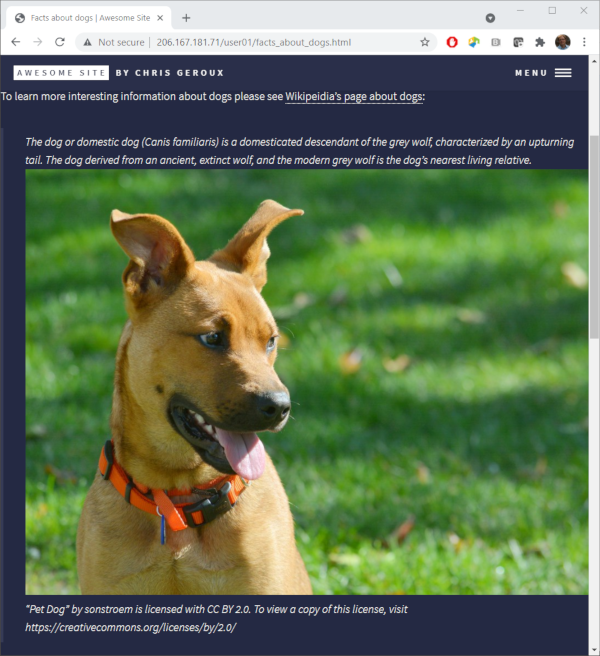
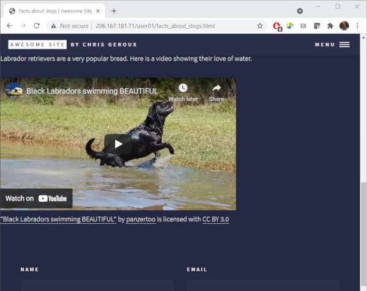

What would be even nicer is if we were able to quote some text from the Wikipedia page so that the readers of our page had some idea of the content on the Wikipedia page before clicking the link.

### Block quotes
You can create block quotes with a `>` followed by a space. Lets copy the first two sentences from the Wikipedia page and create a block quota for it below our link, change the period of our last sentence to a colon, and remove the reference numbers in the Wikipedia text as they don't have any meaning on our page.

~~~
.
.
.

To learn more interesting information about dogs please see [Wikipedia's page about dogs](https://en.wikipedia.org/wiki/Dog):

> The dog or domestic dog (Canis familiaris) is a domesticated descendant of the grey wolf, characterized by an upturning tail. The dog derived from an ancient, extinct wolf, and the modern grey wolf is the dog's nearest living relative.
~~~
{: .output}

We have added a fair amount of new content, links and a block quote, lets have a look at the changes on our page.

You can see our link as a dotted underline below our link text and the link text changes colour when we hover over it with a mouse.The block quoted text appears indented and italic. The appearance of both of these items was decided by the theme we chose. Different themes may make different design decisions about page elements and how they are displayed and formatted. This can also include any of our page and site elements.

### Images

Our page is starting to get a bit more interesting, but to really start to make it engaging we will need an image. You can create and upload your own images to your web-server to use with your website, we will cover that later though. First lets include an image from the Internet. When using images from the Internet you have to be mindful of copy right and licenses associated with the image or creative work. There is, however, an organization called **Creative Commons** (CC) which is devoted to expanding the range of creative works available to others to build upon legally and share. They have developed several copyright-licenses known as **Creative Commons licenses** and they have a website on which you can find a large amount of content with licenses which are permissive enough that we can use them on our websites. To learn more about

> ## Creative Commons license
> This Wikipedia article on [Creative Commons licenses](https://en.wikipedia.org/wiki/Creative_Commons_license) does a good job of explaining the CC licenses. It states:
> > The CC licenses all grant the "baseline rights", such as the right to distribute the copyrighted work worldwide, for non-commercial purposes and without modification.[20] The details of each of these licenses depend on the version, and comprises a selection out of four conditions:
> 
> These for conditions I paraphrase for brevity below:
> * BY: attribution required
> * SA: Share-alike, derived works must be licensed under a license identical to the license that governs the original work.
> * NC: used only for non-commercial purposes
> * ND: may only be used to distribute and display verbatim copies of the work.
{: .callout}

The main creative commons website is at [creativecommons.org](https://creativecommons.org/), but to search their works you can go to the search site at [search.creativecommons.org](https://search.creativecommons.org/). Lets find an image of a dog we would like to use on our page.

So I type in "dog" in the search box and click "search". I also wanted to make sure that image I choose is OK to use for commercial use in case we charged for this workshop at some point. To do this ensure that under "Use" the "Use commercially" box is checked.

The first image I liked in this search is [here](https://openverse.org/image/b2648677-cee5-4bd8-b9ea-8749b5ad2baf?q=dog). The use of this image requires giving the author attribution. 

To include this image we first need the URL of the image. We can get this by right clicking on the image and in the menu that appears we can select "Copy Image Address" in Chrome, "Copy Image Location" in Firefox,  "Copy image link" in Microsoft edge, and "" in Safari. This copies a URL into your clip board we can use to refer directly to the image. Lets use that to include an image in our page.

~~~
.
.
.

To learn more interesting information about dogs please see [Wikipedia's page about dogs](https://en.wikipedia.org/wiki/Dog):

> The dog (Canis familiaris when considered a distinct species or Canis lupus familiaris when considered a subspecies of the wolf) is a domesticated carnivore of the family Canidae. It is part of the wolf-like canids, and is the most widely abundant terrestrial carnivore.

~~~
{: .output}

The syntax to include an image is almost exactly the same as for a link with the addition of the exclamation mark `!` at the beginning. The text inside the square `[` `]` this time is the alternate text that is displayed if the image can't be loaded in the page viewer's browser and again the URL for the image goes inside the curved brackets `(` `)`.

Now we must add the attribution for the image. The Creative Commons website actually makes this pretty easy by providing three options to include this attribution, rich text, HTML, and plain text. Markdown however isn't an option, so lets choose the plain text option. Add this on a line under the image, but lets include two spaces after the image to create a line break so the attribution appears below the image rather than beside it.

~~~
.
.
.

  
"Pet Dog" by sonstroem is licensed with CC BY 2.0. To view a copy of this license, visit https://creativecommons.org/licenses/by/2.0/
~~~
{: .output}
Lets have a look at our updated page.

> ## Add markdown to the image attribution
> We can use the markdown we have learned so far to add links so that it is like the rich text option. This will include creating links for image, author, and license.
> **Hint**: use the right click trick to get the link addresses from the rich text option on the Creative Commons website.
> > ## Solution
> >Start with the image link by again right clicking on the rich text link text and selecting the appropriate option to copy the link address and creating a link for it. Follow the same process for the other two links
> >
> > ~~~
> > .
> > .
> > .
> > 
> > ["Pet Dog"](https://www.flickr.com/photos/96964826@N05/16540146562) by [sonstroem](https://www.flickr.com/photos/96964826@N05) is licensed uder [CC BY 2.0](https://creativecommons.org/licenses/by/2.0/?ref=ccsearch&atype=rich).
> >~~~
> {: .solution}
{: .challenge}

### Embedding Youtube videos
If an image adds some interest to our page, a video should add loads. You can't actually embed a youtube video in your page using markdown only. However, markdown can have HTML embeded directly into it. We aren't going to teach you how to write HTML in this workshop, however, to embed a youtube video in your page using HTML you don't really have to know HTML since the youtube site will generated the needed HTML for you. Lets find a suitable video about dogs on youtube.

While we can't search directly for youtube videos form the Creative Commons site we can apply a filter to a youtube search to show only videos with Creative Commons licenses. Go to [youtube.com](https://www.youtube.com/) and search for "black lab swim". Then click on "FILTERS" at the top, and under the "Features" column select "Creative Commons".

I found this [video](https://www.youtube.com/watch?v=hoCN_0FD9iM&ab_channel=panzertoo) which reminds me of my black lab. Lets add this to our page. To do so go the the video link, and click "SHARE" below the video. It will display a new window with a few options for sharing. We want to "Embed" the video so click that. We are then presented with another window in which we can choose a few options about how we want the video to be embedded in our site and we can click the "COPY" button to copy the HTML for embedding the video you our page.

We can then add this HTML to our markdown page to embed the video on our page.
~~~
.
.
.

"A cute Dog 4" by Chen Vision is licensed with CC BY-NC 2.0. To view a copy of this license, visit https://creativecommons.org/licenses/by-nc/2.0/

Labrador retrievers are a very popular bread. Here is a video demonstrating their love of the water.
<iframe width="560" height="315" src="https://www.youtube.com/embed/hoCN_0FD9iM" title="YouTube video player" frameborder="0" allow="accelerometer; autoplay; clipboard-write; encrypted-media; gyroscope; picture-in-picture" allowfullscreen></iframe>
~~~
{: .output}

Most Creative Commons licenses require attribution. If we look in the description of the video, it lists the creative commons attribution license, which requires we give attribution. We can add attribution in a similar way as we did with the image we used previously, noting that it using the "BY" CC license.

~~~
.
.
.

"A cute Dog 4" by Chen Vision is licensed with CC BY-NC 2.0. To view a copy of this license, visit https://creativecommons.org/licenses/by-nc/2.0/

Labrador retrievers are a very popular bread. Here is a video showing their love of water.

<iframe width="560" height="315" src="https://www.youtube.com/embed/hoCN_0FD9iM?controls=0" frameborder="0" allow="accelerometer; autoplay; clipboard-write; encrypted-media; gyroscope; picture-in-picture" allowfullscreen></iframe>
["Black Labradors swimming BEAUTIFUL"](https://www.youtube.com/watch?v=hoCN_0FD9iM&ab_channel=panzertoo) by [panzertoo](https://www.youtube.com/channel/UCSLHH1LwdBNUJIiwRhi-5cw) is licensed with [CC BY 3.0](https://creativecommons.org/licenses/by/3.0/legalcode)
~~~
{: .output}

Lets save this and see the results.

### Further reading on Markdown

Some markdown we didn't touch on:
* tables
* horizontal rules
* code and syntax highlighting

Additional markdown tutorials and references:
* [daringfireball.net](https://daringfireball.net/projects/markdown/syntax#p)
* [github markdown cheatsheet](https://github.com/adam-p/markdown-here/wiki/Markdown-Cheatsheet)
* [markdownguide.org](https://www.markdownguide.org/basic-syntax/): provides Markdown, the generated HTML and the rendered output in tables.

<!-- possible exercies: what happens if the " " is left out between the "#" and 
the heading text? It isn't treated as a heading. What about if it happens in the
middle of the line? -->

<!-- Another exercise possibility is combining links and images to make an image
 which when clicked taks you some where. -->
