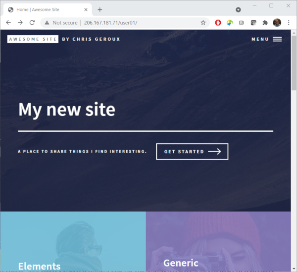

So we have been able to change some content on the home page generated from the `index.md` file. However there are still many elements we might like to change on this home page which don't appear in the `index.md` file. For example, the `FORTY BY HTML5 UP` in the top left, or the text under `My new site`, `A RESPONSIVE SITE TEMPLATE ...`. Where can those items be changed? There are a number of site-wide settings in the `_config.yml` file we have already briefly looked at in order to configure our site to work with our specific web-server configuration. However, there are many other settings in this  `_config.yml` file which we haven't looked at yet. Lets see if any of these items are in there.

~~~
$ nano _config.yml
~~~
{: .bash}
~~~
# site settings
title: Forty
subtitle: by HTML5 UP
email: youremailaddress@gmail.com
description: A responsive site template designed by HTML5 Up  and released under the Creative Commons.
baseurl: "/<your-username>" # the subpath of your site, e.g. /blog
url: # the base hostname & protocol for your site
author:
street_address: 1234 Somewhere Road
city: Nashville
state: TN
zip_code: 55555
country: United States of America
phone: (716) 555-5555
.
.
.
~~~
{: .output}

Ok, we can see those bits of text in this file that we want to change, so lets change them and rebuild our site to see if the update the parts we want. While we are at it, lets put in some other information like our real email address and physical address (not quite my real physical address ;)).
~~~
# site settings
title: Awesome Site
subtitle: by Chris Geroux
email: chris.geroux@ace-net.ca
description: A place to share things I find interesting.
baseurl: "/<your-username>" # the subpath of your site, e.g. /blog
url: # the base hostname & protocol for your site
author: Chris Geroux
street_address: 1234 Some st.
city: Halifax
state: NS
zip_code: 55555
country: Canada
phone: (716) 555-5555
.
.
.
~~~
{: .output}
Now save and exit nano and rebuild our site.
~~~
$ jekyll build -d /var/www/html/<your-username>
~~~
{: .bash}

> ## Pre-defined `_config.yml` settings
> All Jekyll sites have a `_config.yml` file which contain site wide settings. Jekyll defines a number of key-value pairs with default values (see [these Jekyll docs](https://jekyllrb.com/docs/configuration/default/) for the list of predefined keys and their default values). These default key values can be overridden in your site's `_config.yml` file. In addition to these predefined keys, themes can define and use their own custom keys so that different themes can have different keys in their `_config.yml` file. The key `baseurl` which we changed in order to setup our site is one of these predefined keys and the value that came with the theme was overriding the default value of an empty string `""`.
{: .callout}

<!--The only other two which are predefined Jekyll keys are <code>markdown</code> and <code>sass</code>. There are number of different tools used to convert markdown into HTML. These different tools have slightly different ways of interpreting the markdown they are given. The `markdown` key lets you choose what tool is used to convert the markdown you provide to HTML.-->

<!--You will notice that there are also a number of file names ending with the <code>.md</code> suffix. This suffix indicates that these files are markdown files.

The files and directories in this folder include all the information that Jekyll needs to generate a site for you. We downloaded a theme ourselves, rather than installing a gem based theme. This means that all the theme's files are included in our site directory.

We have already looked at `_config.yml` which contains site specific settings, however there are a number of other files and directories here. Lets go over some of the more important of these very briefly.

Content defining files and directories:  
**_posts**: a directory containing markdown files to be converted into posts for the site.  
**assets**: a folder Theme defining file and directories:
**_includes**: HTML include files, to be included in various HTML layouts.  
**_layouts**: HTML include files defining standard page layouts.  
**_sass**: contains files and directories used to style the site.  -->

