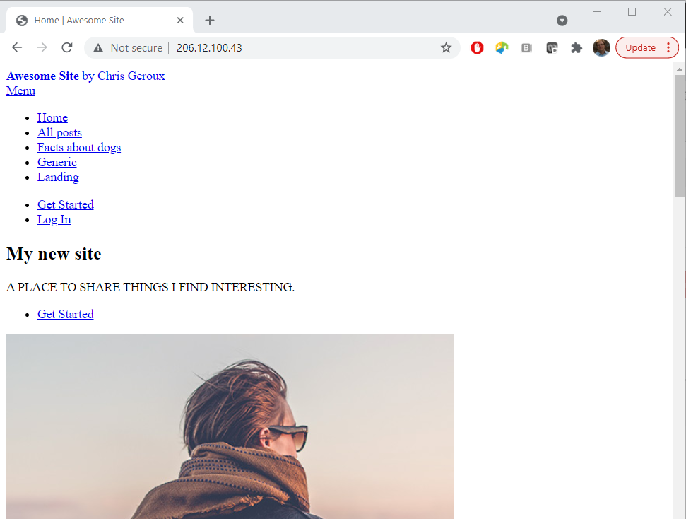

~~~
$ wget http://<your-site-ip>/<your-username>/cloud_workshop_site.tar.gz
$ tar -xzf cloud_workshop_site.tar.gz
~~~
{: .bash}

The first command will download the gzipped tape archive we created of our site previously, and the second command will unpack the zipped archive. Lets check the results
~~~
$ ls -l
~~~
{: .bash}
~~~
total 5292
-rw-rw-r--  1 ubuntu ubuntu 5413844 Oct 12 17:38 cloud_workshop_site.tar.gz
drwxrwxr-x 10 ubuntu ubuntu    4096 Oct  8 19:22 forty-jekyll-theme-master
~~~
{: .output}

Next we need to install any additional gems our site might need. Previously this was done for us on the prepared servers.

~~~
$ cd forty-jekyll-theme-master
$ bundle install
~~~
{: .bashrc}

The final bit of configuration we need to do before building our site is to set the directory permissions of our website's root directory so our current user can write to it. Lets start by taking a look at the current permissions.
~~~
$ ls -l /var/www/
~~~
{: .bash}
~~~
total 4
drwxr-xr-x 2 root root 4096 Oct  6 19:58 html
~~~
{: .output}
Here we see that the `html` folder is owned by the root user. The simplest way to allow our current user to write to that folder is to make that user the owner of that directory. We can do that with the `chown` command.

~~~
$ sudo chown ubuntu:ubuntu /var/www/html
~~~
{: .bash}

And finally we need to change the owner of the default `index.html` that is installed with Apache into the root website directory.
~~~
$ sudo chown ubuntu:ubuntu /var/www/html/index.html
~~~
{: .bash}

Now lets check file ownership is setup correctly.
~~~
$ ls -l /var/www/
~~~
{: .bash}
~~~
total 4
drwxr-xr-x 2 ubuntu ubuntu 4096 Oct  6 19:58 html
~~~
{: .output}
~~~
$ ls -l /var/www/html
~~~
{: .bash}
~~~
total 12
-rw-r--r-- 1 ubuntu ubuntu 10918 Oct  6 19:58 index.html
~~~
{: .output}

Now lets rebuild our jekyll site in our newly setup VM.

~~~
$ bundle exec jekyll build -d /var/www/html
~~~
{: .bash}
The `bundle exec` allows us to run the specific version of ruby gems specified in the Gemfile rather than the, likely newer, default versions.

If we go to the IP address of our virtual machine in our browser, we should see our newly moved website. 

Wait, something doesn't look right. Our site is completely unstyled. If we poke around a little bit maybe looking at the pages source (possibly by pressing `ctrl`+`shift`+`i` depending on your browser) we might notice that the link to our slyte sheets is `/<your-username>/assets/css/main.css`. This worked great on the pre-configured workshop server where our site lived under `/<your-username>` but not on our new server where our site is no longer in a sub directory. To fix this we need to edit our sites `_config.yml` file again.

~~~
$ nano _config.yml
~~~
{: .bash}
~~~
# site settings
title: Awesome Site
subtitle: by Chris Geroux
email: chris.geroux@ace-net.ca
description: A place to share things I find interesting.
baseurl: "user01" # the subpath of your site, e.g. /blog
url: # the base hostname & protocol for your site
author: Chris Geroux
street_address: 1234 Somewhere Road
city: Halifax
state: NS
zip_code: 55555
country: Canada
~~~
{: .output}

To fix this we now need to change the `baseurl` to be set to an empty string so that the line `baseurl: "user01"` becomes `baseurl: ""`. Then exit and save the file and rebuild our site.
~~~
$ bundle exec jekyll build -d /var/www/html
~~~
{: .bash}

Now if we go back and view our moved site it should look as previously. It is not uncommon when moving Jekyll sites to have to  make these sorts of small adjustments to the config file to match the new web server configuration but it usually isn't more than the sort of edit we just made.
