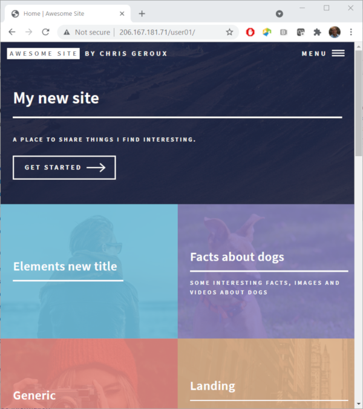

## A few finishing touches

We learned a lot about markdown, but now that we have an understanding of markdown, lets turn back to our website as a whole and see how our new page integrates with the site.

If we click on our site title in the top left "Awesome Site" it will take us back to the home page. If we look at the tiles of the other pages we notice that some of the pre-made pages have images as backgrounds, and they also have a sub title or descriptive text displayed. How do they get those? Also if click into one of those pages, the "Generic" page for example, the layout of content looks a bit different. It has more of a left margin than our page does and the header has an underline. Lets exit our nano text editor `^X`, and open it up with the `generic.md` page to see the differences.

~~~
$ nano generic.md
~~~
{: .bash}
~~~
---
layout: post
title: Generic
description: Lorem ipsum dolor est
image: assets/images/pic11.jpg
nav-menu: true
---

Donec eget ex magna. Interdum et malesuada fames ac ante ipsum primis in faucibus. Pellentesque venenatis dolor imperdiet dolor mattis sagittis. Praese ...
~~~
{: .output}

There are a few differences we can notice right away:
1. the layout is `post` rather than `page`
2. there is a `description` key
3. there is an `image` key

Let first try adding a description to our "facts about dogs" page and see what happens. Exit nano and open it again with our page.
~~~
$ nano facts_about_dogs.md
~~~
{: .bash}
Then edit the front matter to include a description.
~~~
--
layout: page
title: Facts about dogs
description: Some Interesting facts, images and videos about dogs
nav-menu: true
---
.
.
.
~~~
{: .output}
Lets save that and refresh our browser on the main page or our site to see the results. We now see our newly added description of our page showing up. What about the image? Lets reuse the image of the dog we added to the page and add an `image` key to the front matter with the URL to the image we selected.
~~~
--
layout: page
title: Facts about dogs
description: Some Interesting facts, images and videos about dogs
image: https://live.staticflickr.com/8624/16540146562_975cfdb11f_b.jpg
nav-menu: true
---
.
.
.
~~~
{: .output}
Again, write out the results with nano and refresh your browser on the front page of your site.

We now have the descriptive text and the image on the home page tile for our new page, but what about the left margin and the page title underline? If we have a look at our page it is actually still the same. Lets try changing the layout from `page` to `post` and see what happens.
~~~
--
layout: post
title: Facts about dogs
description: Some Interesting facts, images and videos about dogs
image: https://live.staticflickr.com/8624/16540146562_975cfdb11f_b.jpg
nav-menu: true
---
.
.
.
~~~
{: .output}
Now write out the changes and refresh our browser again to see the changes. Great, we now see the left margin space, which I think looks a little nicer, however, we now have our page title "Facts about dogs" with an underline and our header `# Facts about dogs`. Lets remove our header as it is a bit redundant with the `posts` layout. OK, great our page looks pretty good now and is better represented on the home page.

## Posts

What's next? If you have been watching carefully you might be starting to wonder a bit about these "posts" and wondering what they are about. We have just seen that our theme gave us a special layout for posts, which is separate from pages, and also there is an entry for "All posts" in our main site menu at the top right. If we click on that it takes us to a list of pre-made "posts". However, if you scroll all the way through them, you will notice that our "Facts about dogs" page is no where to be found. So it seems that even though our page uses the `post` layout, it still isn't considered a post. So what is considered a post?

Lets exit nano and have a look around our site's source directory to see if we can figure out where these posts are coming form.

~~~
$ ls -l
~~~
{: .bash}
~~~
total 104
-rw-rw-r-- 1 user01 user01    68 Sep  2 03:50 404.md
-rw-rw-r-- 1 user01 user01   693 Sep  2 03:50 CONTRIBUTING.md
-rw-rw-r-- 1 user01 user01   120 Sep  2 03:50 Gemfile
-rw-rw-r-- 1 user01 user01  1656 Sep 20 20:07 Gemfile.lock
-rw-rw-r-- 1 user01 user01 17065 Sep  2 03:50 LICENSE.md
-rw-rw-r-- 1 user01 user01  2939 Sep  2 03:50 README.md
-rw-rw-r-- 1 user01 user01  1094 Sep 21 17:33 _config.yml
drwxrwxr-x 2 user01 user01  4096 Sep  2 03:50 _includes
drwxrwxr-x 2 user01 user01  4096 Sep  2 03:50 _layouts
drwxrwxr-x 2 user01 user01  4096 Sep  2 03:50 _posts
drwxrwxr-x 6 user01 user01  4096 Sep  2 03:50 _sass
-rw-rw-r-- 1 user01 user01   164 Sep  2 03:50 all_posts.md
drwxrwxr-x 6 user01 user01  4096 Sep  2 03:50 assets
-rw-rw-r-- 1 user01 user01 15761 Sep 21 17:39 elements.md
-rw-rw-r-- 1 user01 user01  1784 Sep 22 18:57 facts_about_dogs.md
-rw-rw-r-- 1 user01 user01   650 Sep  2 03:50 forty_jekyll_theme.gemspec
-rw-rw-r-- 1 user01 user01  1645 Sep  2 03:50 generic.md
-rw-rw-r-- 1 user01 user01   168 Sep 21 17:16 index.md
-rw-rw-r-- 1 user01 user01  3544 Sep  2 03:50 landing.md
~~~
{: .output}
So where might there be something to do with "posts"? Oh look, there is a `_posts` directory, that looks promising; lets have a look in there.
~~~
$ cd _posts
$ ls -l
~~~
{: .bash}
~~~
total 24
-rw-rw-r-- 1 user01 user01 1636 Sep  2 03:50 2016-8-20-etiam.md
-rw-rw-r-- 1 user01 user01 1641 Sep  2 03:50 2016-8-21-consequat.md
-rw-rw-r-- 1 user01 user01 1633 Sep  2 03:50 2016-8-22-ipsum.md
-rw-rw-r-- 1 user01 user01 1695 Sep  2 03:50 2016-8-23-magna.md
-rw-rw-r-- 1 user01 user01 1637 Sep  2 03:50 2016-8-24-tempus.md
-rw-rw-r-- 1 user01 user01 1638 Sep  2 03:50 2016-8-25-aliquam.md
~~~
{: .output}
Interesting, we have a list of markdown files with file names containing dates and a name. Interestingly those names look a little bit like the titles for the list of posts we saw in the "All posts" page.

Jekyll has some special support for posts as it is frequently used for blogging. The presence of this special `_posts` folder is part of this extra support and isn't something that our theme supplied, though it did supply the example posts in this folder.

To create a new post you create a new file in the `_posts` folder, however, Jekyll does some special processing of the files in this folder and the filenames of these posts must follow a special format.

~~~
YEAR-MONTH-DAY-title.MARKUP
~~~
{: .code}

Where `YEAR` is a four-digit number, `MONTH` and `DAY` are both two-digit numbers, and `MARKUP` is the file extension representing the format used in the file. All posts must begin with front matter. If we wanted our facts about dogs page to show up as a post we would need to put it in the `_posts` folder, so lets do that.

~~~
$ cp ../facts_about_dogs.md ./2021-09-22-facts-about-dogs.md
~~~

So now we have both a page "facts_about_dogs.md" and a post "2020-10-01-facts-about-dogs.md". Typically you wouldn't want to have duplicate content like this but our "Facts about dogs" page will give us something interesting for our post without having to create it from scratch. Lets refresh our browser and have a look at our new post in the "All posts" page from the sites main menu. If you scroll down you will notice that other posts on this page have their image directly under their title. However, our new post doesn't; why? It turns out if you go digging through the theme's `_layouts/allposts.html` file and know a bit more about how to create Jekyll layouts (which we haven't covered), the layout for the allposts page expects images to be part of your site, rather than located on a different site as we have done. To fix this we would have to download the image and store it locally. This leads us to the idea of 'assets' for our site.

# Assets
Lets download the image we use on our "Facts about dogs" page and store it on our site, but first where should we store the image?

Lets have a look at the `generic.md` file again and see where it references the image it uses.
~~~
$ cd ..
$ nano generic.md
~~~
{: .bash}
~~~
---
layout: post
title: Generic
description: Lorem ipsum dolor est
image: assets/images/pic11.jpg
nav-menu: true
---
.
.
.
~~~
{: .output}

So that page is getting the image it is using from the `assets/images` directory. Lets refresh our memory of what happens when our site is generated.

* Directories and files beginning with an `_` are ignored by the normal Jekyll processing and are not copied to the site destination directory.
* Files containing front matter are transformed into new files in the destination directory.
* Files without front matter that don't begin with an `_` are copied as they are into the same directory structure in destination directory as the source directory.

The assets folder is not prefixed with an `_`, nor is the `images` or the file `pic11.jpg`. However, the image file does not have any front matter, it is a regular image file. So this **static** file is copied over to our destination directory, and placed in the same directory as in the source directory.

So to include our dog image in our live site we must place it somewhere in our source directory and the `assets/images` directory is a good place as it groups it together with the other images already there that we got with our theme. We could of course place it anywhere within our source directory or sub directories within it, but the assets directory is a good convention to stick with for storing 'assets' used by our site. So lets download our image there.

First lets go find the URL of our image. It is stored in our "Facts about dogs" page.
~~~
$ nano facts_about_dogs.md
~~~
{: .bash}
~~~
.
.
.

"Pet Dog" by sonstroem is licensed with CC BY 2.0. To view a copy of this license, visit https://creativecommons.org/licenses/by/2.0/
.
.
.
~~~
{: .output}
Lets copy the URL and exit nano. Now lets download it. We can use the `wget` command to do this.
~~~
$ wget https://live.staticflickr.com/8624/16540146562_975cfdb11f_b.jpg -O assets/images/dog.jpg
~~~
{: .bash}
The `-O` option (capital oh) tells `wget` where we want the downloaded file to be saved. Lets double check that the file is where we expect it.
~~~
$ ls -l assets/images
~~~
{: .bash}
~~~
total 2008
-rw-rw-r-- 1 user01 user01 589247 Sep  2 03:50 banner.jpg
-rw-rw-r-- 1 user01 user01 137084 Feb 24  2019 dog.jpg
-rw-rw-r-- 1 user01 user01  62690 Sep  2 03:50 forty.jpg
-rw-rw-r-- 1 user01 user01  54651 Sep  2 03:50 pic01.jpg
.
.
.
~~~
{: .output}
There we see our new dog image. Now we can reference it in our post's `image` keys so that it will be properly included in the "All posts" page.
~~~
$ nano _posts/2021-09-22-facts-about-dogs.md
~~~
{: .bash}
~~~
---
layout: post
title: Facts about dogs
description: Some Interesting facts, images and videos about dogs
image: https://live.staticflickr.com/8624/16540146562_975cfdb11f_b.jpg
nav-menu: true
---
.
.
.
~~~
{: .output}
and change it to
~~~
---
layout: post
title: Facts about dogs
description: Some Interesting facts, images and videos about dogs
image: assets/images/dog.jpg
nav-menu: true
---
.
.
.
~~~
{: .output}
Lets write those changes out to the file (`^O`) and exit nano(`^X`) and have a look at the changes to our site.

> ## Uploading files via SFTP
> If you took a picture with your camera and uploaded it to your laptop, or if you created a figure in a graphics tool like [GIMP](https://www.gimp.org/) or [InkScape](https://inkscape.org/), you can upload it to your VM using SFTP. MobaXterm has built in SFTP support, and Mac and Linux operating systems have a built in `sftp` command. If you would like to use a GUI SFTP client, [filezilla](https://filezilla-project.org/) is a good cross platform GUI SFTP client.
{: .callout}

# Preparing to move our site
In the next part of our workshop we will walk through how to setup the cloud infrastructure to host our Jekyll site in the Alliance Cloud. Once we have this setup we can move the site we have already created over to our VM and deploy it there. In order to do this we will create a zipped, tape archive file containing all of our source directory. We will create this file in our website's directory to make it easy to download later.

To do this we will use the `tar` command which creates tape archives.

~~~
$ cd ~
$ tar -czf /var/www/html/user01/cloud_workshop_site.tar.gz ./forty-jekyll-theme-master/
~~~
{: .bash}

This command creates (`-c`) a [Gzipped](https://www.gnu.org/software/gzip/) (`z`) archive file (`f`) `cloud_workshop_site.tar.gz` in the same directory as our website `/var/www/html/user01/`. We can then later download this G-zipped archive from our website to our site's new location.

If everything went correctly we should be able to go to

`http://<your-site-ip>/<your-username>/cloud_workshop_site.tar.gz`

in your browser and it should start downloading your zipped archive. We don't actually need to download it but it is a good way to check that the archive has been created properly and you can access it over the internet.

# More to learn about Jekyll?
We have covered most of the basics of Jekyll which will allow you to create pages, posts, and upload and include your own pictures and videos on your pages. However, there are more advanced topics to learn about which will help you when developing your Jekyll sites. We won't cover them here but I wanted to make you aware of them so you would have some idea of where to look if you wanted to do more.

* **HTML** is used to create the layouts of your theme, to customize your theme you will need to know some HTML at a minimum. A good place to learn about HTML is [w3schools](https://www.w3schools.com/html/).
* **CSS** (Cascading Style Sheets) often the styling in themes is described using CSS. Again [w3schools](https://www.w3schools.com/css/default.asp) has a good tutorial about CSS.
* **JavaScript** is a programming language used to create dynamic elements, such as menus, on your site. [w3schools](https://www.w3schools.com/js/default.asp) has java script covered.

There is also more to learn about Jekyll its self.
* Jekyll uses a templating language called [**Liquid**](https://jekyllrb.com/docs/liquid/), which allows you to reference values, from for example your pages front matter, in your HTML layouts.
* Jekyll also provides the concept of [**Collections**](https://jekyllrb.com/docs/collections/) which allows you to group related content and has some interesting uses when combined with HTML page layouts and the Liquid templating language.
* Finally Jekyll also has support for [**plugins**](https://jekyllrb.com/docs/plugins/), which allow you create or use different types of page generators for example.

<!--
#### GitHub can host your jekyll site
[github.com](https://github.com/) is a web platform to host [git](https://git-scm.com/) repositories. Git is a version control software which helps manage different versions of your documents. GitHub offers [GitHub pages](https://pages.github.com/) to host your [jekyll](https://jekyllrb.com/docs/github-pages/) based sites. See this [guide](https://guides.github.com/features/pages/) for more information about creating Jekyll pages on GitHub.
-->
