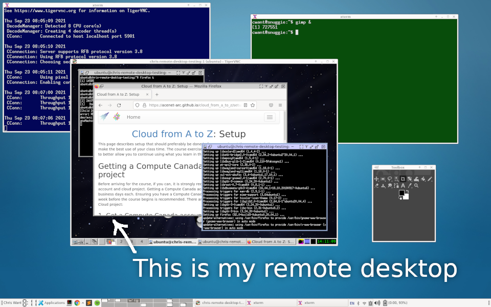

In this section we will provide some background for remote desktop, and discuss the strategy we will take to get it to work.

## Remote Desktops

From [Wikipedia](https://en.wikipedia.org/wiki/Remote_desktop_software):

| In computing, the term remote desktop refers to a software or operating system feature that allows a personal computer's desktop environment to be run remotely on one system (usually a PC, but the concept applies equally to a server), while being displayed on a separate client device.

The below image shows an illustration of this:

In the image, a laptop operating system shows a blue desktop. On that desktop are a few windows. One of those windows is a remote desktop client. That window shows the desktop of another computer, in this case a desktop on a cloud VM.

Within this remote desktop window (when it is in focus), one can type in the window and use the mouse to driving the user interface of the other computer.

Note that the cloud VM doesn't really have a display/monitor hooked up to it, so the desktop we are seeing is a virtual one -- the "display" it is "on" exists only in software.

One can run almost any software on this virtual desktop that could be run on a real one: web browsers, terminals, editors, statistical packages, image processing packages, etc. Software that uses fancy 3D rendering (e.g,. via the OpenGL standard) may not work correctly, or may not run at all.

In some applications, one can use remote desktop software to connect to another PC with an actual display and drive the interaction seen on the screen of the other computer.

## VNC

There are some software choices to consider for connecting to a remote desktop running on a remote computer. The one that we will choose is VNC, but another popular choice is X2Go.

Again, from [Wikipedia](https://en.wikipedia.org/wiki/Virtual_Network_Computing):

| In computing, Virtual Network Computing (VNC) is a graphical desktop-sharing system that uses the Remote Frame Buffer protocol (RFB) to remotely control another computer. It transmits the keyboard and mouse input from one computer to another, relaying the graphical-screen updates, over a network.

What we can take away from this (but not something that we'll need to think about typically) is that VNC is a system that uses a specific network protocol to achieve a task (in this case, viewing and controlling another computer). That protocol is called RFB, so the client machine (e.g., your laptop) and the remote machine (the cloud VM) need to speak it for the remote desktop connection to work.

There are a number of separate software implementations of VNC, and some common ones are:

* TigerVNC
* RealVNC
* TightVNC

For VNC to work, we need to run a VNC server on the remote cloud VM, and a VNC client on your laptop.

## Displays and Ports

We've noted that our cloud VM will have a display that is defined entirely in software. (As opposed to having a physical display.)

Since our display is detached from the physical hardware, we could (in theory) have multiple displays, if we really wanted to -- each display would be defined entirely in software.

VNC needs to handle this possibility, so it gives each display a display number. (Full disclosure: this convention actually comes from a windowing system called X Windows that VNC uses for it's graphical user interface.)

With this system, we put a colon in front of that number, so we might have displays `:0`, `:1`, `:2`, and onward. The display with number `:0` is usually reserved for a physical display, so by default most VNC servers will use display number `:1` as the default.

So suppose we have a VNC server that is serving display `:1` on a remote server. How do we connect to it? We need to use a VNC client on our computer to connect to a specific port of the remote cloud VM. By default VNC **adds 5900** to the display number to get the port that you need to connect to with the VNC client.

So for display `:1`, the VNC server is running on port `5901` on the remote VM (and this is the port that our VNC server has to connect to).

Similarly, if we had a display identified by the number `:2`, the VNC client would need to connect to port `5902` on the remote cloud VM, where the VNC server is running.

And so on ...

## SSH tunneling

The network protocol (RFB) that allows VNC to work is pretty basic, and doesn't really handle security well. This means that a third party could potentially look at the stream of data travelling between our desktop and the remote machine and intercept pictures of what our computer desktop looks like. Or look at the key presses we are making on our keyboard.

VNC software often supports certificate based encryption to alleviate this.
This is fairly difficult to set up, and is often used in multi-user systems.
An example of such a system is the Graham VDI nodes provided by
the Alliance:

<https://docs.alliancecan.ca/wiki/VNC#VDI_Nodes>

Many people prefer to use VNC through an encrypted channel.
This channel is often called a tunnel, and the software used to create the tunnel
is the same SSH software we are using to connect to our VM for a command line interface.

This also solves a problem of opening up our firewall further. Recall that the SSH server is running on port `22`. We want to connect to port `5901` to access the remote desktop via VNC. Ordinarily this would mean opening up port 5901 of our Openstack firewall to the Internet. Every time you open another port in the firewall, you increase the chances that an intruder can come in ...

Using an option in SSH, we will trick our desktop computer into think that we are running a VNC server on port 5901 of the desktop computer (`localhost`). When we connect to port 5901 of our desktop server, SSH will grab the network traffic, send it through the SSH port (`22`) to the remote cloud VM. and instruct the remote machine to send the data to port `5901` on the remote machine. In point form:

* We run a VNC server on the remote cloud VM on port `5901`.
* We set up an SSH tunnel to forward traffic from port `5901` of our desktop machine (`localhost`) to port `5901` of the remote cloud VM.
* All of this forwarding traffic actually goes through the standard port `22` that SSH uses. (No additional firewall rules needed.)
* We instruct the VNC client/viewer software to connect to port `5901` of our local desktop/laptop machine.
* the VNC viewer is 'tricked' ... it thinks it's connecting display `:1` of the local machine (port `5901`), but the network traffic if really communicating with port `5901` on the cloud VM.

Whew ... clear as mud, right?

This is the setup we will use to make a connection to a remote desktop running on a cloud VM in the following sections.
