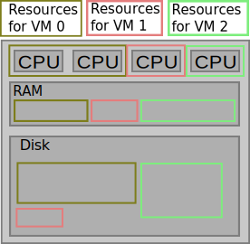
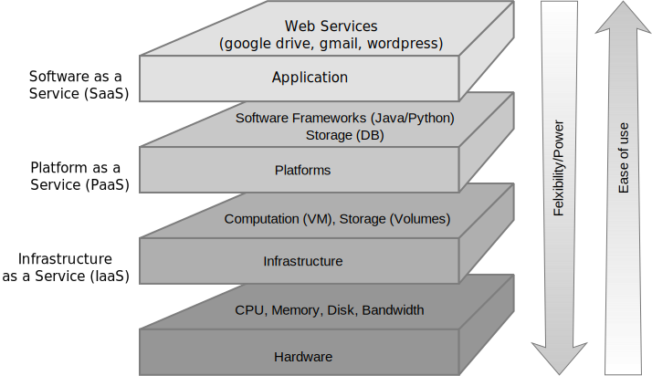
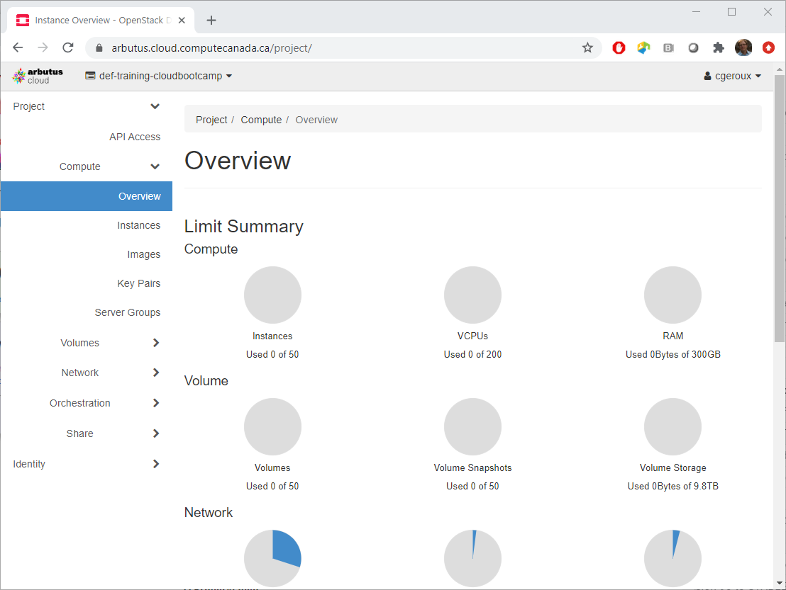
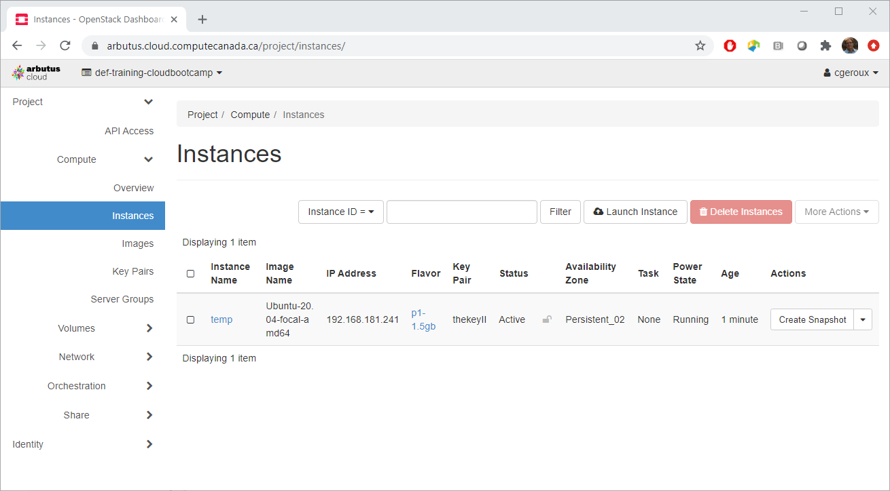
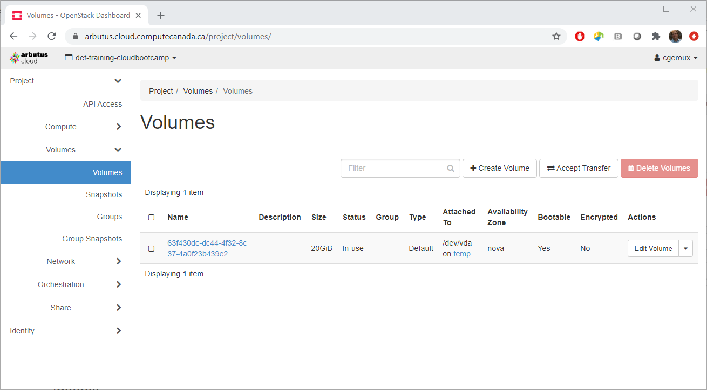
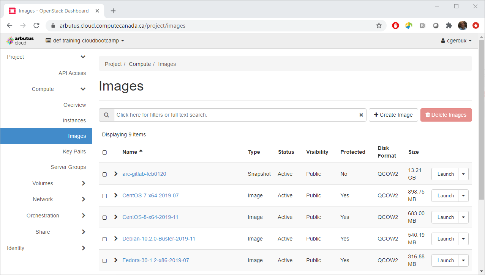
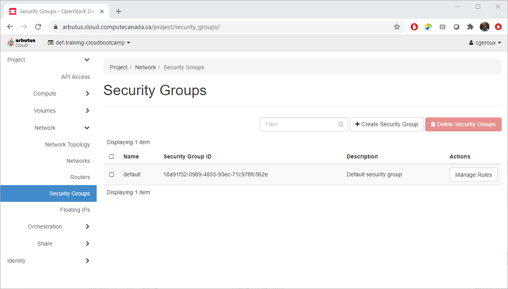
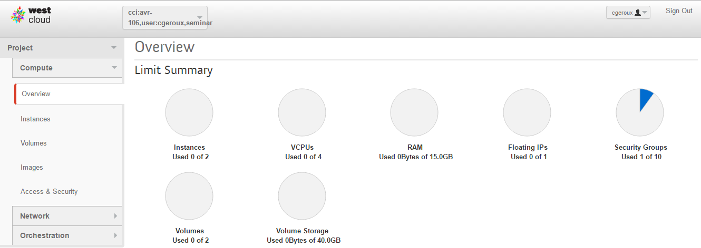

In the previous episode we talked about how some aspects of the Internet work. To visit a website you enter a domain name into your browser which is converted to an IP address which directs your request to a computer (or LAN which then routes your request to a specific computer within that LAN based on the type of traffic) which then provides your computer with the data for the web page you requested.

Anyone connected to the Internet can potentially put up a website for the world to see. This ability for anyone to create a website is part of what makes the Internet so great, in that you don't need lots of money and infrastructure to do this, just a computer and an Internet connection and some time to burn setting it up. However, what happens as your website grows in popularity? You get many more computers requesting your content, at some point this becomes too much for a single computer to handle so, you have to go out and get more computers. This adds not only the cost of the computers but also the time to set them up. In addition, that high load you just got, well it was a passing phase, and no one wants to visit your site any more and you have 10 computers you paid for not being used anymore. This is a problem of scalability and elasticity. The problem of a lack of [**scalability**](../reference#scalability) arises from not being able to easily increase your hardware resources to cope with an increased demand for your website. The problem of a lack of [**elasticity**](../reference#elasticity) arises when you can not return the hardware when you no longer require it.

## What is cloud computing?

Cloud computing can solve the problem of scalability and elasticity described above, but what is the cloud and how does it solve this problem?

A first description of the cloud could be **it is someone else's computer** that you rent or borrow. But borrowing or renting a laptop from someone is not a cloud, so there is more to a cloud than being someone else's computer that you rent or borrow. Generally a cloud isn't something you physically possess as a user of it. You **access a cloud remotely** across the Internet. However, people have been remotely accessing computers for a long time before the term cloud was used so there are still more characteristics which make clouds unique.

What does a cloud computing environment have that these previously mentioned cases don't? One big characteristic is **on-demand service**. You are able to request resources (and get them) without additional human interaction. In other words, click some buttons on a website to get access to more devices, usually within seconds. More over, you can customize these devices using the website (or web-interface), for example request a computer with 2 [**CPU**](../reference#cpu)s, 7 GB of [**RAM**](../reference#ram), and 80 GB of disk space. Does this mean the providers of the cloud service had a computer sitting in their server room with exactly the hardware you requested waiting for you? No, they use a technology called [**hardware virtualization**](../reference#hardware-virtualization) which is the simulation of hardware using software. What this means is that you can simulate the hardware you requested on different physical hardware. For example a computer with 4 CPUs, 16GB of RAM, and 1TB of disk space can be used to simulate a computer having only 1 CPU and 4 GB or RAM with 100 GB of disk space. A simulated computer is usually referred to as a [**virtual machine**](../reference#virtual-machine) or **VM**. In this way a single physical machine can simulate multiple VMs.

The host machine and software performing the virtualization are often referred to as a virtual machine monitor or [**hypervisor**](../reference#hypervisor). A virtual disk can be simulated by a file residing on the host operating system's file system. It is possible to migrate virtual machines from one physical piece of hardware to another. This makes cloud infrastructure more resilient than traditional physical hardware in that a virtual machine can be migrated off a physical machine for upgrades and maintenance allowing the virtual machine to remain available while the original physical machine hosting the virtual machine is unavailable for maintenance.

There are many different providers of cloud services for example, [Amazon Web Service](https://en.wikipedia.org/wiki/Amazon_Web_Services), [Microsoft Azure](https://en.wikipedia.org/wiki/Microsoft_Azure), [DigitalOcean](https://en.wikipedia.org/wiki/DigitalOcean), and many more. In general you pay for cloud services on a per usage bases. To make this billing possible there is almost always some form of **resource usage monitoring and tracking** built into a cloud platform.

## Cloud Service Models

So far we have been talking about clouds providing virtual devices as a service, also known as [**Infrastructure as a Service (IaaS)**](../reference#iaas). Which means the cloud provider is providing the virtualized hardware as a service. One of the benefits of IaaS is that you don't have to ensure the physical hardware keeps working, the IaaS provider takes care of that for you. If instead you ran your own server for your website and a disk fails you would be responsible for replacing it and ensuring that there was no data loss. IaaS removes the requirement to actually manage the hardware. Managing the operating system and software is the responsibility of the user of the service. Infrastructure as a service allows the greatest amount of flexibility and power to configure and setup your computing environment as you like apart from actually managing the hardware yourself. With this great flexibility comes the responsibility to ensure that security patches and operating system updates are applied and that backups are made in case of disaster. This service model also requires that the user understand how to setup and configure their environments.

There are several other service models that are possible with clouds ranging form IaaS to [**Software as a Service (SaaS)**](../reference#saas) at the other end of the spectrum, where software services, such as Gmail or Facebook, are provided.  In the middle of these two extremes is [**Platform as a Service (PaaS)**](../reference#paas) which provides an environment already configured with the tools required to develop software. An example of PaaS would be a high performance computing (HPC) environment where programming languages and libraries are installed and configured to allow the user to dive into writing code to solve their problem.

## Why Alliance Cloud?

First and for most it is a free service offered to faculty, librarians, researchers, post docs, and students at academic institutions across Canada so many may continue to use the Alliance cloud after this workshop. Second we have easy access to the resources and experts who create and maintain the Alliance Cloud. Third the Alliance cloud uses [**OpenStack**](../reference#openstack) which is a popular widely used open source cloud operating system. Many of the concepts you will learn while working with the Alliance cloud will be applicable to many other cloud providers such as AWS and Azure with the notable exception of how those cloud providers monitor usage and bill for usage as the Alliance Cloud does not bill users but instead has resource allocation competitions [RAC](https://alliancecan.ca/en/services/advanced-research-computing/accessing-resources/resource-allocation-competition) to gain access to resource above the levels available through our Rapid Access Service [RAS](https://docs.alliancecan.ca/wiki/Cloud_RAS_Allocations) which any new cloud project can access.

## OpenStack
If you have an Alliance cloud project at Arbutus you can login to the OpenStack dashboard (a.k.a Horizon) at the [Arbutus login page](https://arbutus.cloud.computecanada.ca/) or if you have a project on another Alliance cloud you can find the login url on the "Using the Cloud" section of our [main cloud docs page](https://docs.alliancecan.ca/wiki/Cloud#Using_the_Cloud). Using any Alliance cloud should be fine though there maybe slight differences as some of our clouds use different versions of OpenStack and some have different security protocols (see [CC Cloud Resources](https://docs.alliancecan.ca/wiki/CC-Cloud_Resources) for current Alliance cloud OpenStack versions and hardware specs).

#### Different ways to participate in this workshop:

* **Use your own cloud project:** you will need to have some free quota available. You will need at least enough to create one minimal VM booting from a volume. This would likely mean at least one unused VCPU, 1.5GB of RAM, and 20 GB of volume storage. However, it would be better to have double that quota available in order to create a second VM if needed.

* **Use guest account in workshop project:** If you don't have a current Alliance cloud project, or if you don't have the available free quota for at least for one VM we will provide you with a guest account in a shared cloud project specifically for this workshop.

Lets log into an Allinace cloud OpenStack dashboard now and explore some of the common pages or panels you will be working within OpenStack.

**Everyone logged into an OpenStack dashboard?**

Once you login to the OpenStack dashboard you will be presented with the "Overview" panel as shown below.

This panel shows you an overview (go figure) of your current project's usage and quota on OpenStack. An OpenStack user can be associated with **multiple projects** each project has their own quota and a project can have multiple users. Your project's OpenStack quota dictates the maximum number of VM instances, [**VCPU**](../reference#vcpu)s, RAM, Floating IPs, Security Groups, Volumes, and Volume/Snapshot Storage you may use within that project.

> ## Require more resources?
> If you require an increase in your project quota and you are use our RAS and your new requirement still doesn't exceed our [cloud RAS limits](https://docs.alliancecan.ca/wiki/Cloud_RAS_Allocations) you can request an increase in the same way as you originally requested our cloud RAS [here](https://docs.alliancecan.ca/wiki/Cloud#Getting_a_Cloud_project). If you require more resources than are available through RAS you can apply for a [RAC](https://alliancecan.ca/en/services/advanced-research-computing/accessing-resources/resource-allocation-competition) which occur annually, generally in the fall semester.
{: .callout}

In the top right corner there is a drop down menu where you can access account settings and the sign out link. At the top left the current active project is displayed and a drop down menu can be used to switch between projects if you are a member of multiple projects.

### Instances (VMs)
[**Instances**](../reference#instance) is a commonly used term in cloud computing which is synonymous with the term virtual machine.

The "Instances" panel shows all running instances and information about those instances. It allows you to **perform actions on an instance** or set of instances such as "Shutdown", "Delete", and "Reboot" and many other actions. You can click on the instance name to get even more information about the instance. Of particular note is the **"Log" tab** which is a log of actions the VM performs, for example things that happen when the VM boots or is restarted or shutdown. If for some reason your VM is not working as expected there may be clues in the log which can help you figure out what is going on. Most importantly this panel allows you to create new instances with the **"Launch Instance"** button which we will explore in the next episode.

### Volumes
[**Volumes**](../reference#volume) in OpenStack act like storage devices and can be attached to VMs like attaching an external hard drive or a USB stick. The Volumes panel allows you to view your currently created volumes and information about your volumes as well as creating and managing volumes.

### Images
[**Images**](../reference#image) are files which contain data from a hard drive or volume. Images allow you to make copies or backups of your volumes and virtual machines. Volumes can be created from an Image by coping the data the Image contains to the volume. Images can be private to your project, shared with others, or completely public. Images can be downloaded and used in other clouds or with desktop tools such as [**VirtualBox**](../reference#virtualbox) which allows you to run your cloud VMs on your laptop.

There are a number of public images provided by the Alliance Cloud to be used as starting points for virtual machines (for example and image containing the Ubuntu Linux operating system) and will be periodically updated as new releases come out. These image names typically have the format `<OS-name>`-`<OS-version>`-`<OS-version-name>`-`<architecutre>`-`<date>`. Examples of `<OS-name>` are "Ubuntu", "Centos", "Fedora", "Debian" which are different Linux distributions. `<OS-version>` might look something like "37-1.7" or "20.04.5". `<OS-version-name>` might be something like 'Buster', but not all Linux distributions use version names so not all images provided by the Alliance team will have those. `<architecutre>` is often "x64" to indicate the operating systems are 64-bit.

### Security Groups

Your VM can belong to a number of security groups. A **security group** contains a collection of rules that limit how connections can be made to and from the VMs belonging to that security group. These rules can limit how your VMs:
* access the internet
* access other VMs in the OpenStack project
* how other computers can access VMs from the internet

New projects all start with a default security group which contains some basic rules. These rules allow VMs full access out to the internet and between VMs belong to that security group but do not allow connections originating outside of that security group to access the VMs.

Security group rules often pertain to specific ports or ranges of ports and allow access into or out of VMs for specific types of traffic, e.g. HTTP (port 80), HTTPS (port 442).

> ## How many virtual machines can be created?
> Looking at the above screen shots, what is the largest number of virtual machines that can be created?
>
> 1. 200
> 2. 50
> 3. 0
>
> > ## Solution
> >
> > 1. 200 are the number of virtual CPUs (VCPUs), a virtual machine (VM) or instance can have multiple virtual CPUs. In some cases this could limit the number of virtual machines you can make depending on how many VCPUs you choose per VM.
> > 2. 50 instances are another name for virtual machines.
> > 3. 0 we have enough resources to create many virtual machines, including up to our quota limit of 50 instances or virtual machines.
> {: .solution}
{: .challenge}

> ## What can you limit with a security group?
> What access can you limit with your security groups? Choose all that apply.
>
> 1. Which sites on the Internet your VM can access.
> 2. Which computers can access your VM from the Internet
> 3. Which images can be accessed by your VM.
> 4. Which VMs in your project can access other VMs in your project.
> 5. Which volumes can be attached to your VM.
> 6. Which of your VM's users can perform administrative tasks.
>
> > ## Solution
> >
> 1. Which sites on the Internet your VM can access. (Yes)
> 2. Which computers can access your VM from the Internet (Yes)
> 3. Which images can be accessed by your VM. (No, VMs typically don't access OpenStack images but rather they are used when initially creating your VM)
> 4. Which VMs in your project can be accessed by other VMs in your project. (Yes)
> 5. Which volumes can be attached to your VM. (No, any available volume in your project can be attached to a VM)
> 6. Which of your VM users can perform administrative tasks. (No, this is managed totally within your VM and not within OpenStack)
> {: .solution}
{: .challenge}

> ## Most recent image?
> What is the most recent release of Ubuntu available?
>
> Hint: look at the "Images" panel under the "Compute" section on the left hand menu of the OpenStack dashboard.
> > ## Solution
> > Go to 'Compute' then 'Images' to find the `Ubuntu-22.04.2-Jammy-x64-2023-02' image, and note that the middle portion '22.04.2' is the Ubuntu operating system version.
> > Ubuntu 22.04.2
> {: .solution}
{: .challenge}

> ## Default security group rules?
> What are the security rules for the default security group?
> > ## Solution
> > Go to 'Network' then 'Security Groups' and click 'Manage Rules' in the row for the 'default' security group, to find the rules:
> >
> > |Direction|Ether Type|IP Protocol|Port Range|Remote IP Prefix|Remote Security Group|
> > |-        |-         |-          |-         |-               |-                    |
> > |Egress   |IPv4      |Any        |Any       |0.0.0.0/0       | -                   |
> > |Egress   |IPv6      |Any        |Any       |::/0            | -                   |
> > |Ingress  |IPv4      |Any        |Any       | -              | default             |
> > |Ingress  |IPv6      |Any        |Any       | -              | default             |
> {: .solution}
{: .challenge}

<!-- > ## Public images
> Look at the images panel and see what images are available to create new virtual machines. Do you recognize any of the image operating system names and or versions?
>
>Hint: you may need to select different tabs to see all the images available.
>
> > ## Solution
> > Some images of common Linux and Windows operating systems available on the cloud:
> > * CentOS 6/7
> > * Ubuntu 14/16
> > * Fedora 25/26
> > * Debian 8/9
> > * Windows Server 2012
> > Images lists might be slightly different between Compute Canada clouds.
> {: .solution}
{: .challenge}

> ## Largest Volume
> 
> What is the largest volume that could be newly created given the quota and usage displayed in the *Overview* page above?
>
> 1. 40 GB
> 2. 40 KB
> 3. 0 GB
> 4. 80 GB
>
> > ## Solution
> > 1. No, while the total quota is 40 GB it is actually already used up with 2 other volumes.
> > 2. No, the total quota of 40 GB is already completely used. Note that quotas are in GB and not KB even if there is no unit indicated.
> > 3. Yes, in fact you couldn't create a volume at all because both the storage quota and the number of allowed volumes (2) are already reached.
> > 4. No, the total quota is 40 GB and 40 GB of it have already been used.
> {: .solution}
{: .challenge} -->
