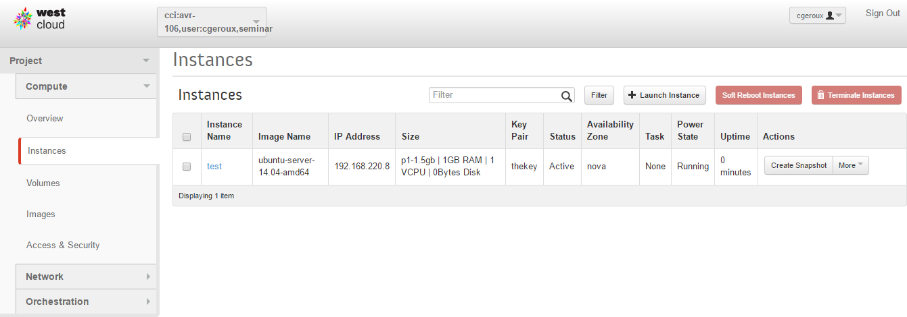
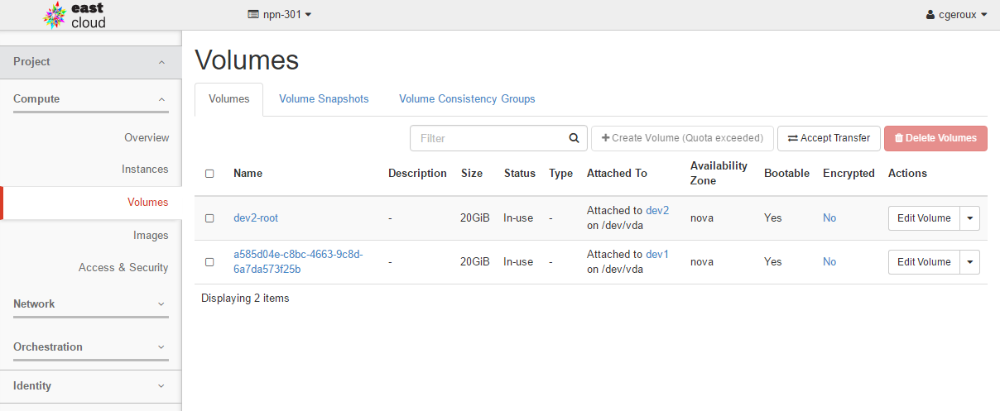
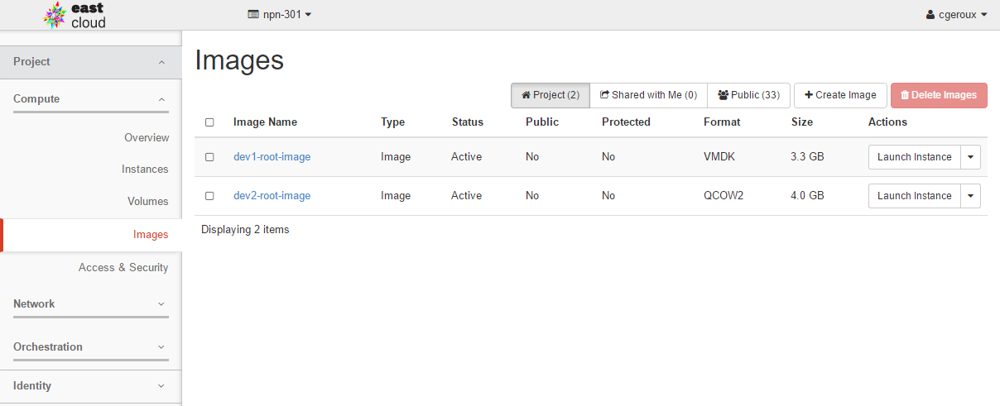
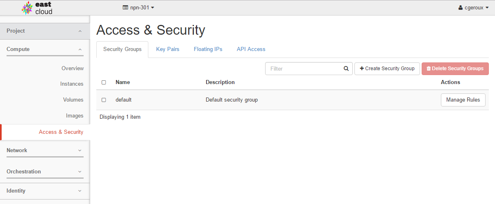

In the previous episode we looked at how the Internet works at a very basic level. To visit a website you enter a domain name into your browser which is converted to an IP address which directs your request to a computer (or LAN which then routes your request to a specific computer within that LAN based on the type of traffic) which then provides your computer with the data for the web page you requested. 

Anyone connected to the Internet can potentially put up a website for the world to see. This ability for anyone to create a website is part of what makes the Internet so great, in that you don't need lots of money and infrastructure to do this, just a computer and an Internet connection and some time to burn setting it up. However, what happens as your website grows in popularity? You get many more computers requesting your content, at some point this becomes too much for a single computer to handle so, you have to go out and get more computers. This adds not only the cost of the computers but also the time to set them up. In addition, that high load you just got, well it was a passing phase, and no one wants to visit your site any more and you have 10 computers you paid for not being used anymore. This is a problem of scalability and elasticity. The problem of a lack of **scalability** arises from not being able to easily increase your hardware resources to cope with an increased demand for your website. The problem of a lack of **elasticity** arises when you can not return the hardware when you no longer require it.

## What is cloud computing?

Cloud computing can solve the problem of scalability and elasticity described above, but what is the cloud and how does it solve this problem?

A first description of the cloud could be **it is someone else's computer that you rent or borrow**. But borrowing or renting a laptop from someone is not a cloud, so there is more to a cloud than being someone else's computer that you rent or borrow. Generally a cloud isn't something you physically possess as a user of it. You **access a cloud remotely** across the Internet. However, people have been remotely accessing computers for a long time before the term cloud was used so there are still more characteristics which make clouds unique.

What does a cloud computing environment have that these previously mentioned cases don't? One big characteristic is **on-demand service**. You are able to request resources (and get them) without additional human interaction. In other words, click some buttons on a website to get access to more devices, usually within seconds. More over, you can customize these devices using a web interface, for example request a computer with 2 CPUs, 7 GB of RAM, and 80 GB of disk space. Does this mean the providers of the cloud service had a computer sitting in their server room with exactly the hardware you requested waiting for you? No, they use a technology called **hardware virtualization** which is the simulation of hardware using software. What this means is that you can simulate the hardware you requested on different physical hardware. For example a computer with 4 CPUs, 16GB of RAM, and 1TB of disk space can be used to simulate a computer having only 1 CPU and 4 GB or RAM with 100 GB of disk space. A simulated computer is usually referred to as a **virtual machine** or **VM**. In this way a single physical machine can simulate multiple VMs.

The host machine and software performing the visualization are often referred to as a virtual machine monitor or **hypervisor**. A virtual disk can be simulated by a file residing on the host operating system's file system. It is possible to migrate virtual machines from one physical piece of hardware to another. This makes cloud infrastructure more **resilient** than traditional physical hardware in that a virtual machine can be migrated off a physical machine for upgrades and maintenance allowing the virtual machine to remain available while the original physical machine hosting the virtual machine is unavailable for maintenance.

There are many different providers of cloud services for example, [Amazon Web Service](https://en.wikipedia.org/wiki/Amazon_Web_Services), [Microsoft Azure](https://en.wikipedia.org/wiki/Microsoft_Azure), [DigitalOcean](https://en.wikipedia.org/wiki/DigitalOcean), and many more. In general you pay for cloud services on a per usage bases. To make this billing possible there is almost always some form of **resource usage monitoring and tracking** built into a cloud platform. 

## Cloud Service Models

So far we have been talking about clouds providing virtual devices as a service, also known as **Infrastructure as a Service (IaaS)**. Which means the cloud provider is providing the virtualized hardware as a service. On of the benefits of IaaS is that you don't have to ensure the physical hardware keeps working the IaaS provider takes care of that for you. If instead you ran your own server for your website and a disk fails you would be responsible for replacing it. IaaS removes the requirement to actually manage the hardware. Managing the operating system and software is the responsibility of the user of the service. Infrastructure as a service allows the greatest amount of flexibility and power to configure and setup your computing environment as you like it apart from actually managing the hardware yourself. With this great flexibility comes the responsibility to ensure that security patches and operating system updates are applied and that backups are made in case of disaster. This service model also requires that the user understand how to setup and configure their environments them selves. 

There are several other service models that are possible with clouds ranging form IaaS to **Software as a Service (SaaS)** at the other end of the spectrum where software services, such as gmail or Facebook, are provided.  In the middle of these two extremes is **Platform as a Service (PaaS)** which provides an environment already configured with the tools required to develop software. An example of PaaS would be an high performance computing (HPC) environment where programing languages and libraries are installed and configured to allow the user to dive into writing code to solve their problem, or a Hadoop cluster where you can write Apache Spark code to process your data. Both of these use cases could be deployed within a cloud environment or directly on hardware.

## Why Compute Canada Cloud?

First and for most it is a free service offered to faculty, librarians, researchers, post docs, and students at academic institutions across Canada, so many may directly use what is leaned here. Second we have easy access to the resources and experts who created and maintain the Compute Canada Cloud. Third the Compute Canada cloud uses **OpenStack** which is a popular widely used open source cloud operating system. Many of the concepts you will learn while working with the Compute Canada cloud will be applicable to many other cloud providers such as AWS and Azure with the notable exception of how those cloud providers monitor usage and bill for usage as the Compute Canada Cloud does not bill users but instead has allocation competitions to gain access to resource above default allocations. These allocation competitions work in a similar way for cloud resources as they do with other Compute Canada resources. For more information about resource allocation competitions see the [Compute Canada RAC](https://www.computecanada.ca/research-portal/accessing-resources/resource-allocation-competitions/) page. In addition to RAC, there is also a Rapid Access Service available see [RAS](https://www.computecanada.ca/research-portal/accessing-resources/rapid-access-service/#cloud) which is a way to gain a smaller boost to your quota than with a RAC but in less time.

## OpenStack
If you have a Compute Canada cloud account at Arbutus (a.k.a west-cloud) you can login to the OpenStack dashboard (a.k.a Horizon) at the [Arbutus login page](https://west.cloud.computecanada.ca/) or if you have an east-cloud account you can login at the [east-cloud login page](https://east.cloud.computecanada.ca/). Using either cloud should be fine though the two clouds do run different versions of OpenStack (see [CC Cloud Resources](https://docs.computecanada.ca/wiki/CC-Cloud_Resources) for current CC cloud OpenStack versions and hardware specs) and you may notice some minor differences between the two.

Once you login to the OpenStack dashboard you will be presented with the "Overview" panel as shown below.
 

This panel shows you an overview (go figure) of your current project's usage and quota on OpenStack. An OpenStack user can be associated with multiple projects each project has their own quota and a project can have multiple users. Your project's OpenStack quota dictates the maximum number of VM instances, VCPUs, RAM, Floating IPs, Security Groups, Volumes, and Volume/Snapshot Storage you may use within that project. To increase the quota of a project you need to apply to a [RAC](https://www.computecanada.ca/research-portal/accessing-resources/resource-allocation-competitions/) or [RAS](https://www.computecanada.ca/research-portal/accessing-resources/rapid-access-service/#cloud) as mentioned above.

In the top right corner you have access to account settings and the sign out link. At the top is the current active project. You are likely only a member of one project, but you can potentially be a member of many projects and this drop down menu allows you to choose the project you are actively working on.

### Instances (VMs)
The "Instances" panel shows all running instances and information about those instances. It allows you to perform actions on an instance or set of instances such as "Shutdown", "Terminate", and "Reboot" and many other actions. You can click on the instance name to get even more information about the instance. Of particular note is the "Log" tab which is a log of actions the VM performs, for example things that happen when the VM boots or is restarted or shutdown. If for some reason your VM is not working as expected there may be clues in the log which can help you figure out what is going on. Most importantly this panel allows you to create new instances with the "Launch Instance" button which we will explore in the next episode.

### Volumes
Volumes in OpenStack act like storage devices and can be attached to VMs like attaching an external hard drive or a USB stick. The Volumes panel allows you to view your currently created volumes and information about your volumes as well as creating and managing volumes.

### Images
Images are files which contain data from a hard drive or volume. Images allow you to make copies or backups of your volumes and virtual machines. Volumes can be created from an Image by coping the data the Image contains to the volume. Images can be private to your project, shared with others, or completely public. There are a number of public images provided by the Compute Canada Cloud to be used as starting points for virtual machines (for example and image containing the Ubuntu Linux operating system). Images can be downloaded and used in other clouds or with desktop tools such as [VirtualBox](https://www.virtualbox.org/) which allows you to run your cloud VMs on your laptop.

### Access and Security

The Access & Security panel serves a number of functions. It allows you to set rules to dictate which ports data can be sent and received from and to your VMs limiting the types of interactions your VM can have with the outside world using the "Security Groups" tab. You can specify a "key" to access your VMs on the "Key Pairs" tab (we will talk more about keys in the next episode). The Access & Security panel allows you allocate Floating IPs to use in your project to access your VMs from the outside world and finally to allows you to access your OpenStack projects from command line tools on the *API Access* tab, which we will talk about later in this course.

> ## Public images
> Look at the images panel and see what images are available to create new virtual machines. Do you recongnize any of the image operating system names and or versions?
> 
> > ## Solution
> > There are:
> > * CentOS 6/7
> > * Ubuntu 14/16
> > * Fedora 25/26
> > * Debian 8/9
> > * Windows Server 2012
> {: .solution}
{: .challenge}