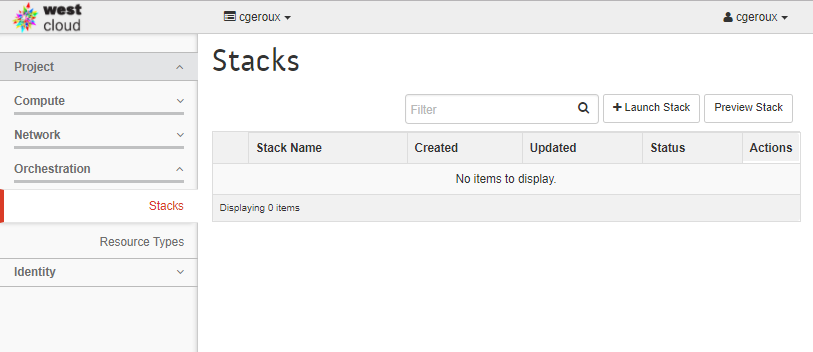

In this episode we will learn how to perform automated cloud environment orchestration using Heat Orchestration Templates (HOT).

HOTs are YAML files describing the configuration of your virtual machines, floating IP address, volumes, security rules and more. HOTs can be combined with cloud-init to perform the initial setup on newly created virtual machines.

To use a HOT go to the Orchestration drop down and select ''stacks''. A stack in this context is a group of OpenStack resources and you can create a new ''stack'' using a HOT. To do so click on ''Launch Stack''.

