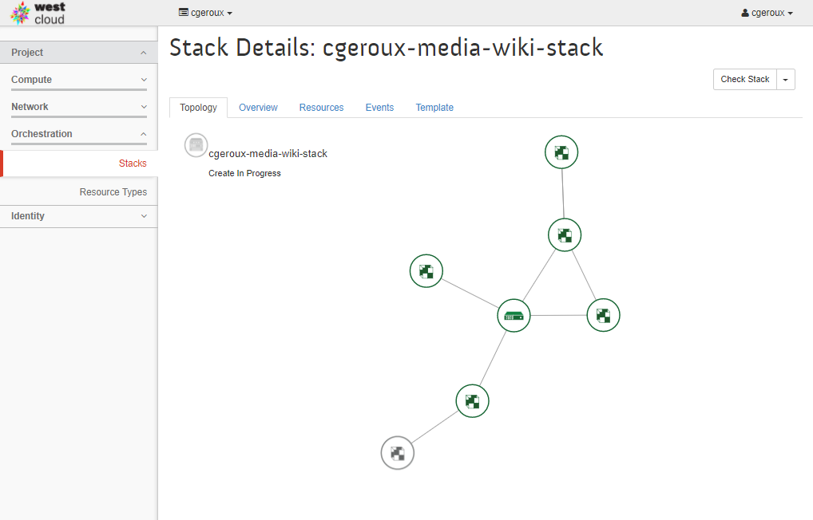
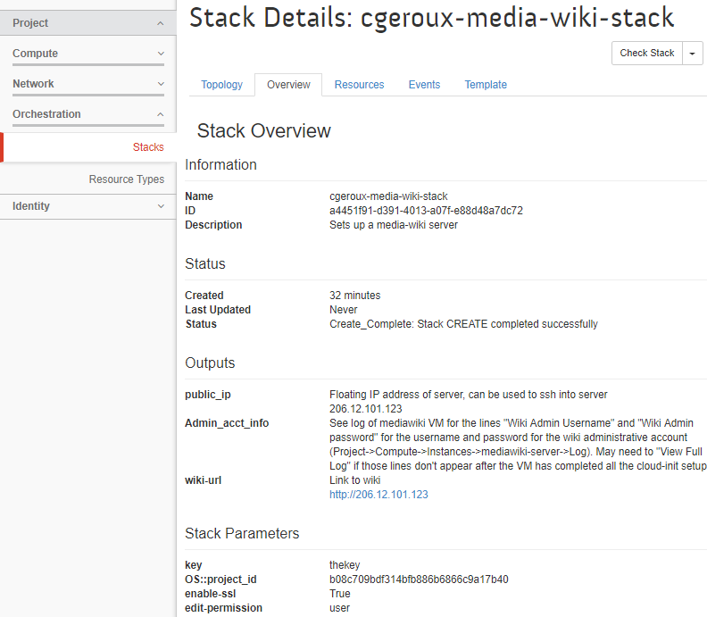

In this episode we will learn how to perform automated cloud environment orchestration using Heat Orchestration Templates (HOT).

HOTs are YAML files describing the configuration of a stack of resources in your OpenStack project including virtual machines, floating IP address, volumes, and security rules. HOTs can be combined with cloud-init to perform the initial setup on newly created virtual machines. We will use a pre-made MediaWiki HOT [https://raw.githubusercontent.com/cgeroux/heat-mediawiki/master/heat.yaml](https://raw.githubusercontent.com/cgeroux/heat-mediawiki/master/heat.yaml). 

This HOT does the following:

* Creates a volume.
* Creates a VM booting from the volume.
  * Passes in a cloud-init script to setup MediaWiki software with settings provided by us.
* Allocate a new floating IP.
  * Associate it with VM
* Create a new security group
  * Add rule for SSH
  * Add rule for HTTP
  * Add rule for HTTPS

To use a HOT go to the Orchestration drop down and select *stacks*. A stack, in this context, is a group of OpenStack resources and you can create a new *stack* using a HOT. To do so click on *Launch Stack* brining up a *Select Template* dialogue. This is where you tell OpenStack the template to use to create your stack. To use the MediWiki HOT select *URL* from the *Template Source* drop down and copy and paste the above URL into the *Template URL* text box. Then click the *next* button which will bring up a dialogue to enter various parameters used to customize the stack and software setup.

Beside each of the parameters is a "?" which when you hover over it will provide a description of the parameter and perhaps some guidance on what should be chosen. We will use the following settings:
* **Stack Name**: &lt;your-name&gt;-media-wiki-stack 
* **Creation Timeout**: leave default 60 minutes
* **Wiki Name**: &lt;your wiki name&gt;
* **Wiki administrator**: &lt;your-username&gt;
* **Enable uploads**: check the box
* **Wiki Logo URL**: leave as the default.
* **MediaWiki Version**: Leave as the default *1.27*
* **Mediawiki Patch**: lave as the default *0*
* **Falvor**: *p1-1.5gb*
* **Image**: *ubuntu-server-14.04-amd64*
* **Key-pair name**: &lt;name-of-keypair-used-to-ssh-to-vm&gt;
* **Volume Name**: &lt;your-name&gt;-mediawiki_root
* **Volume Size**: 10 GB
* **Private network name or ID**: &lt;your-project-name&gt;_network
* **Public Network**: select *VLAN3337*
* **Enable SSL**: check the box
* **Read permission**: leave as default *user*
* **Edit permission**: leave as default *user*
* **Account creation permission**: leave as default *sysop*

Once you *launch* the new stack, you can click on the *Stack Name* for more details on your stack. The first screen you are presented with is the ''Topology'' tab shown below.

This tab shows an overview of the components created by the HOT and their status. Once you see that the creation has completed, take a look at the *Overview* tab. Of particular interest on this tab is the *Outputs* section. This section lists outputs spefic to the HOT used. In our case of the media-wiki HOT it lists the public IP of the VM, how to get administrative account info (e.g. username/password) and a link to the wiki.

Lets look up our username and password by going to *Compute*->*Instances* and clicking on the name of our mediawiki VM (hint it will be named after your stack). Then select the *Log* tab. You may need to wait until the setup of the VM completes which may take several minutes. Once it is done you should see a line like:

~~~
Cloud-init v. 0.7.5 finished at Mon, 16 Apr 2018 17:47:28 +0000. Datasource DataSourceOpenStack [net,ver=2].  Up 232.29 seconds
~~~
{: .output}

Above that you will see the <code>Wiki Admin Username:</code> and <code>Wiki Admin password:</code> fields which you can use to log into your newly created mediawiki VM.

Because the HOT uses self signed SSL certificates, you will see a warning such as **Your connection is not private**. This indicates that the validity of your server's SSL certificate can not be verified against a recognized signing authority. That makes sense since we didn't register it with one. You can safely advance to your mediawiki server and the communications will be encrypted. In 
* **Chrome** click on *Advanced* and then on *Proceed to ...*
* **Firefox** click on *Advanced* -> *Add Exception...* -> *Confirm Security Exception*
* **Edge** click on *Details* -> *Go on to the webpage*
